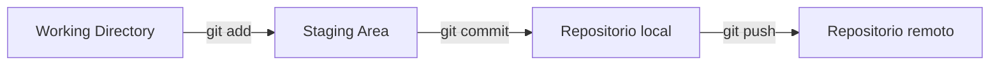

<!-- slide: tipo=portada -->
# Introducción a Git
Control de versiones y flujo de trabajo colaborativo
Clase 07 — 2026

---

<!-- slide: tipo=agenda -->
## Agenda
- Qué es control de versiones
- Comandos esenciales
- Ramas y merge
- Trabajando con GitHub
- Cierre y práctica

---

## Por qué versionar código

Un sistema de control de versiones registra el historial completo de
cambios de un proyecto: quién cambió qué, cuándo y por qué. Permite volver
atrás sin miedo, trabajar en paralelo sin pisarse el trabajo de otra
persona, y entender la evolución del código con el tiempo en lugar de
perderla en carpetas como `final_v2_ok.zip`.

---

# Comandos esenciales

---

## El ciclo básico
- **git init** — crea un repositorio nuevo en la carpeta actual {tag:info}
- **git add** — mueve cambios al staging area {tag:tip}
- **git commit** — el mensaje debe ser descriptivo {tag:note}
- **git push** — sincroniza los commits locales con el remoto {tag:warning}
- **git push --force** — sobreescribe el historial remoto {tag:danger}

---

## git status


---

## Deshacer el último commit
```bash
# mantiene los cambios en el staging area
git reset --soft HEAD~1

# descarta los cambios por completo
git reset --hard HEAD~1

$ git log --oneline -3
```

---

## Automatizar con un hook
```python
import sys

# valida que el mensaje del commit no sea muy corto
def check_message(msg):
    if len(msg) < 10:
        return False
    return True

msg = sys.argv[1]
if not check_message(msg):
    print("El mensaje del commit es muy corto")
    sys.exit(1)
```

---

## Las tres áreas de Git


---

# Ramas y merge

---

## Trabajar en ramas
Cada rama es una línea de trabajo independiente. Creá una rama por feature
con `git branch`, cambiate con `git checkout`, y cuando termines integrá
los cambios de vuelta a `main` con `git merge`.


---

<!-- slide: tipo=comparacion -->
## merge vs. rebase

### git merge
- Conserva el historial completo tal cual pasó
- Crea un commit de merge
- Seguro para ramas compartidas

### git rebase
- Reescribe el historial como una línea recta
- No crea commit de merge
- Evitar en ramas que otros ya bajaron

---

# Trabajando con GitHub

---

<!-- slide: tipo=hasta-6-imagenes -->
## Del fork al pull request

1. Fork del repositorio


2. Clonar en local


3. Commit y push a tu fork


4. Abrir el pull request

---

<!-- slide: tipo=comparacion tag=tip tag-label="Recomendado" -->
## Clonar por SSH

### Pros
- No pide usuario ni contraseña en cada push
- Más seguro que HTTPS con contraseña
- Estándar en equipos profesionales

### Contras
- Hay que generar y agregar una clave SSH una vez

---

# Cierre y práctica
Repasamos lo esencial y encaramos el primer ejercicio con Git.


---

> Talk is cheap. Show me the code.
> — Linus Torvalds, creador de Git

---

<!-- slide: tipo=bibliografia -->
## Bibliografía
1. Pro Git — Scott Chacon & Ben Straub (git-scm.com/book)
2. Git Internals — documentación oficial de Git (git-scm.com/docs)
3. GitHub Docs — Guía de Pull Requests (docs.github.com)

---

<!-- slide: tipo=cierre -->
# Gracias
Próxima clase: SSH para GitHub — dudas@intro-camejo.fiuba
