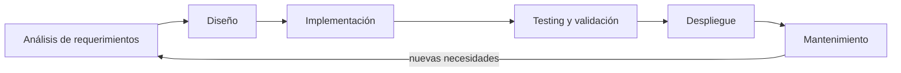
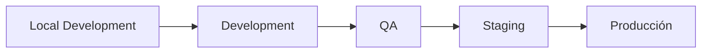
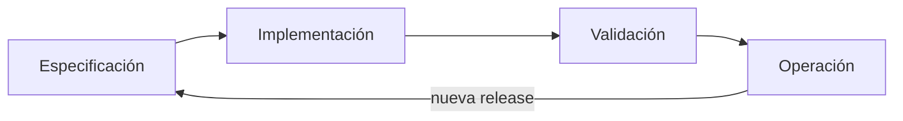

<!-- slide: tipo=portada -->
# Ingeniería de Software
Qué es, qué hace a un buen software y cuáles son sus etapas.

---

<!-- slide: tipo=agenda -->
# Agenda
- Ingeniería y Software
- Análisis de requerimientos
- Diseño
- Implementación
- Testing y validación
- Despliegue
- Mantenimiento

---

# Ingeniería y Software

---

## ¿A qué llamamos Ingeniería?

- Del latín *ingenium*: **engendrar, producir**.
- Todas las definiciones (RAE, FIUBA, UNR) repiten el mismo patrón: conjunto de **conocimientos** aplicados en **acciones** sobre **áreas** con un **fin**.
- **Conocimientos**: científicos, técnicos y empíricos.
- **Acciones**: invención, gestión, desarrollo, optimización, validación…
- **Áreas**: maquinaria, equipos, procesos, sistemas…
- **Fin**: solucionar un problema, satisfacer una necesidad. {tag:tip}

---

## ¿Qué es el Software?

- De chicos nos dicen que es "la parte intangible de la computadora". Es mucho más que eso.
- Intenten pensar un momento u objeto de la vida cotidiana que no esté influenciado por software. {tag:note}
- **Estándar 729 (IEEE)**: conjunto de programas de cómputo, procedimientos, reglas, documentación y datos asociados que forman parte de las operaciones de un sistema de computación.
- Tipos: de sistemas, de aplicación, de ingeniería o ciencias, embebido, IA… y más.

---

## ¿Qué hace a un buen software?

- **Cumple su objetivo.** Si esto falla, lo demás no importa. {tag:tip}
- Puede ser utilizado.
- Tiene buena performance.
- Es mantenible.
- Es confiable (*reliable*).
- Es seguro (*secure*).

---

## ¿Por qué no alcanza con sentarse a programar?

- El software es masivo y cotidiano: hay muchas personas interesadas y sus opiniones varían. Hay que **entender el problema antes de desarrollar**.
- Gobiernos y redes masivas dependen de sistemas software: la complejidad convierte al **diseño** en una actividad crucial.
- El más mínimo error puede ser crítico para el usuario final: el software debe ser **de calidad**.
- Con el tiempo llueven pedidos de mejora: gana importancia la **capacidad de mantenimiento**. {tag:warning}

---

## Entonces, ¿qué es la Ingeniería de Software?

Consiste en aplicar Ingeniería al proceso completo de creación de software: desde el momento en que surge la necesidad o problemática hasta el despliegue y mantenimiento de la solución elaborada. Y hoy en día, además, es **iterativa e incremental**.

---

## Las etapas

---

# Análisis de requerimientos

---

## ¿Qué buscamos?

- **Entender lo que el cliente o usuario quiere o necesita**: ¿cuál es el objetivo? ¿cómo se adapta a las necesidades de los usuarios finales? ¿cómo va a usarse?
- **Construir el producto adecuado** ≠ construir adecuadamente el producto. {tag:note}
- **Comprender el alcance**, para evitar desvíos, retrasos y costos extra.

---

> To replace programmers with AI, clients will need to accurately describe what they want. We're safe. — Dr. Milan Milanović

---

## ¿Cómo? Ingeniería de requerimientos

Indagación, negociación, especificación y validación. Es la disciplina que traduce lo que el cliente dice a algo que el equipo puede construir y verificar.

---

## Objetivos

- Describir lo que quiere el cliente.
- Establecer las bases para el diseño del software.
- Definir requerimientos que **puedan ser validados**. {tag:tip}

---

# Diseño

---

> Si crees que una buena arquitectura es cara, intenta con una mala. — Brian Foote & Joseph Yoder, "Big ball of mud"

---

## Cuando el diseño falla

- **Friendster**: problemas graves de escalabilidad y lentitud extrema. Los usuarios migraron a alternativas como Facebook. *Costo: murió como red social.* {tag:danger}
- **HealthCare.gov**: sistema armado con múltiples proveedores sin una arquitectura coherente; el sitio colapsó en su lanzamiento. *Costo: rehacer gran parte del sistema + impacto político enorme.* {tag:danger}
- **Cyberpunk 2077**: motor no preparado, mismo código para PC, PS4 y XboxOne. *Costo: reembolsos, caída del valor de la empresa y años de retrabajo.* {tag:danger}

---

## Elegir la arquitectura

En base a los requerimientos funcionales y no funcionales es muy importante escoger la arquitectura de software más adecuada: cliente-servidor, microservicios, monolito, event-driven… Cada una resuelve bien algunos problemas y mal otros.

---

# Implementación

---

## De los requerimientos al producto

Involucra todos los pasos necesarios para pasar de los requerimientos a un producto funcional: modelar el dominio, diseñar los datos, escribir el código y llegar a algo que el usuario pueda usar.

---

## El camino típico

- Diagramas de clases y de secuencia: cómo se estructura y cómo interactúa el sistema.
- Modelo de entidad-relación: cómo se guardan los datos.
- Código.
- Producto funcionando.

---

## ¿Eso es todo?

No: tiene que ser un proceso **organizado**. Sin organización se pasa muy rápido de un proyecto prolijo a uno que nadie puede tocar sin romper otra cosa. {tag:warning}

---

# Testing y validación

---

> El fracaso es, a veces, más fructífero que el éxito. — Henry Ford

---

## ¿No son lo mismo?

### Verificación
- ¿Estamos construyendo **bien** el producto?
- Encontrar errores en el funcionamiento.

### Validación
- ¿Estamos construyendo el producto **correcto**?
- Demostrarle al cliente que el software cumple los requerimientos.

---

## Razones para testear

- Demostrar al cliente que el software cumple los requerimientos (validación).
- Encontrar errores en el funcionamiento (verificación).
- Inspirar cambios en los requerimientos. {tag:info}

---

## Tipos de test

- Pruebas unitarias.
- Pruebas de integración.
- UAT (*User Acceptance Test*).
- Pruebas de usabilidad.

---

## ¿Quién las hace?

Que exista un equipo de QA no quiere decir que uno no tenga que probar su propio código. {tag:warning}

---

# Despliegue

---

## Entornos

- **Development**: donde se desarrolla.
- **QA**: donde se prueba.
- **Preproducción / Staging**: réplica de producción para la validación final.
- **Producción**: donde están los usuarios reales. {tag:danger}

---

## El camino de un cambio

---

# Mantenimiento

---

## ¿Qué pasa después del despliegue?

- Surgen nuevos requerimientos.
- El software tiene que actualizarse para mantener su utilidad.
- Hay cambios en el negocio.
- Aparecen errores no detectados. {tag:warning}

---

## Espiral de la evolución del software

Basado en "Software Engineering", Sommerville.

---

## ¿Es siempre lineal esto?

No. En la práctica el proceso es **iterativo e incremental**: se vuelve a etapas anteriores todas las veces que haga falta. Lo van a ver en detalle en otras materias.

---

<!-- slide: tipo=bibliografia -->
## Bibliografía

- PRESSMAN — "Software Engineering: A Practitioner's Approach", Capítulo 1.
- SOMMERVILLE — "Software Engineering", Capítulo 1.
- SOFTWARE ENGINEERING COORDINATING COMMITTEE — "SWEBOK".

---

<!-- slide: tipo=cierre -->
## Gracias
Próxima clase: nos metemos con el proceso de desarrollo.
