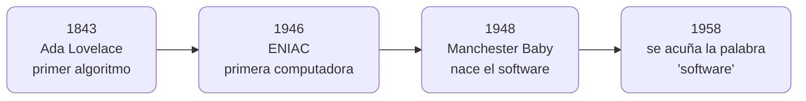
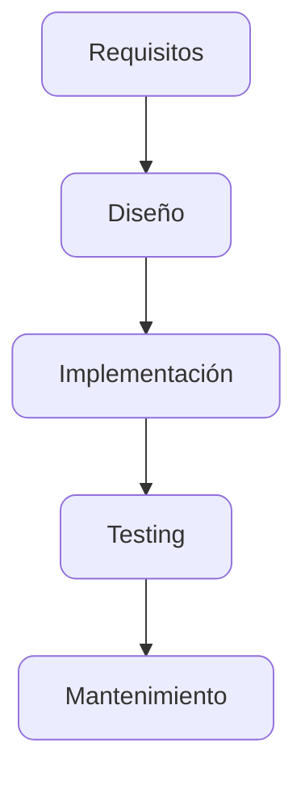

<!-- slide: tipo=portada -->
# Ingeniería de Software II
De la crisis del software a Scrum, Kanban y GitHub Projects

Clase {{completar}} · 2026

---

# Los orígenes del software

---

<!-- slide: tipo=diagrama -->
## Línea de tiempo: 1843 → 1958

---

## 1843 — El primer algoritmo (sin máquina que lo corra)

- El algoritmo calculaba la secuencia completa de los números de Bernoulli, usando el resultado de cada paso para calcular el siguiente
- Para lograrlo, definía una serie de instrucciones que se repetían una y otra vez — lo que hoy llamamos un bucle — además de variables que guardaban resultados intermedios {tag:tip}
- Lo escribió Ada Lovelace en 1843, como parte de sus notas sobre el Analytical Engine de Charles Babbage — una computadora mecánica que **nunca llegó a construirse** {tag:info}
- Es reconocida como la autora del primer programa de la historia — **100 años antes** de que exista una máquina capaz de ejecutarlo

---

## 1946 — La primera computadora (todavía sin software)

- **ENIAC**, construida entre 1943 y 1945, presentada en público en febrero de 1946
- 18.000 válvulas, 10.000 capacitores, 6.000 interruptores, 40 gabinetes de 2,7 metros de altura
- Programarla significaba **recablearla físicamente** — mover clavijas y switches durante días para cada problema nuevo {tag:warning}

---

## 1948 — Nace el software

- 21 de junio de 1948, Universidad de Manchester: la "Baby" corre el primer programa almacenado en memoria electrónica
- 17 instrucciones escritas por Tom Kilburn, 52 minutos, 3,5 millones de operaciones
- El quiebre conceptual: por primera vez el programa se **guarda y ejecuta**, no se cablea a mano {tag:tip}

---

## 1958 — Aparece la palabra "software"

- El estadístico John Tukey la usa por primera vez en una publicación (American Mathematical Monthly)
- La contrasta explícitamente con "hardware"
- El lenguaje tardó **10 años** en ponerse a la altura del concepto {tag:note}

---

## Contexto: los 50s en números

- 1955: apenas unas 250 computadoras en funcionamiento en todo el mundo {tag:info}
- Usos dominantes: cálculo balístico y militar, censos, y las primeras nóminas y contabilidad empresarial
- Programar era escribir en binario o lenguaje ensamblador — FORTRAN (1957) y COBOL (1959) recién estaban naciendo

---

# 1960s — La escala explota

---

## Contexto: los 60s en números

- Hacia 1965, ya había unas 20.000 computadoras en funcionamiento en todo el mundo — 80 veces más que una década antes {tag:tip}
- SABRE, sistemas bancarios y de nómina: el software empieza a tocar la vida cotidiana de millones de personas, aunque sea indirectamente
- 1969: IBM separa el software del hardware — hasta entonces venía gratis con la máquina {tag:warning}
- Nace la industria del software como sector comercial independiente: aparecen las primeras empresas dedicadas solo a vender software

---

## 1964-1966 — El problema se vuelve gigante

- El desarrollo de OS/360, el sistema operativo del System/360, se retrasa en relación al cronograma, IBM suma más programadores para recuperar tiempo.
- El sistema operativo OS/360 llega a tener **más de 1.000 personas** trabajando en simultáneo
- Sale en 1966: tarde y con costos varias veces por encima de la estimación {tag:danger}
- En base a esto se publica el libro "The Mythical Man-Month" de Fred Brooks, el propio manager del proyecto

---
<!-- slide tipo=imagen-bleed -->
## Se empieza a vislumbrar

---

## 1968 — Se le pone nombre: "la crisis del software"

- Con el fracaso de OS/360 todavía fresco, un grupo de expertos se reúne en Garmisch, Alemania, en la primera Conferencia de Ingeniería de Software de la OTAN
- Acuñan el término "crisis del software": la industria sabe construir hardware cada vez más potente, pero no sabe construir el software para aprovecharlo — a tiempo, dentro de presupuesto, y que funcione {tag:danger}

---

# 1970s — Nace Waterfall

---

## Contexto: los 70s en números

- A principios de los 70s ya había medio millón de computadoras en funcionamiento en todo el mundo {tag:tip}
- Hacia 1979, el gasto en software en los países de la OCDE ya superaba los 51.900 millones de dólares {tag:info}
- Aparecen las minicomputadoras — el software empieza a salir de la gran sala de máquinas corporativa

---

<!-- slide: tipo=diagrama -->
## 1970 — La Metodología Waterfall

---

## El nacimiento de Waterfall

- Winston Royce, ingeniero de TRW, publica "Managing the Development of Large Software Systems"
- Define fases secuenciales: requisitos → diseño → implementación → testing → mantenimiento
- **La ironía**: el propio paper advertía sobre los riesgos de un enfoque puramente secuencial y recomendaba loops de feedback — la industria se quedó con el diagrama simple y descartó las advertencias {tag:warning}

---

## 1974 — la crisis sigue viva

- Varias publicaciones describen al software de la industria como poco confiable, mal documentado y demasiado costoso {tag:warning}
- No fue un problema que se resolvió al nombrarlo en 1968 — siguió siendo el estado normal de la industria durante toda la década
- El "costo de arreglar" seguía creciendo cuanto más tarde se detectaba un error, exactamente el punto débil de un proceso 100% secuencial

---

# 1980s — Software para todos

---

## Contexto: los 80s en números

- En 1980 se vendían unas 500.000 computadoras personales por año en todo el mundo — hacia 1985 ya eran 3,7 millones por año {tag:danger}
- El mercado global de software crece de ~10.000 millones de dólares (1980) a ~100.000 millones (1990) — **10 veces en una década** {tag:tip}
- Aparece el software "de góndola": VisiCalc, Lotus 1-2-3, WordPerfect, MS-DOS

---

# 1990s-2001 — El quiebre y la respuesta ágil

---

## Contexto: los 90s en números

- 1991-95: la World Wide Web hace que Internet sea utilizable por gente sin formación técnica
- Para el año 2000, ya había más de 500 millones de computadoras en funcionamiento en todo el mundo {tag:tip}

---

## 1990-95 — Denver International Airport

- Sistema automatizado de manejo de equipaje: contrato original de **193 millones de dólares**
- Construido y probado como un bloque monolítico, sin entregas incrementales {tag:warning}
- Resultado: **16 meses** de atraso, hasta **560 millones de dólares** por encima del presupuesto, 1.1 millones de dólares por día en intereses de deuda {tag:danger}

---

## 1994 — El CHAOS Report

- Relevamiento de 365 empresas y más de 8.000 aplicaciones de software
- Solo **16%** de los proyectos terminó a tiempo y dentro de presupuesto {tag:danger}
- **53%** quedó "desafiado" (sobrecostos, atrasos, funcionalidad recortada) — **31%** se canceló directamente
- Los proyectos que sí se completaban se pasaban, en promedio, **189%** del presupuesto original
- Las 3 causas principales: falta de input del usuario, requisitos incompletos y requisitos que cambiaban en el camino — exactamente lo que Waterfall no puede absorber {tag:info}

---

## 2001 — El Manifiesto Ágil

- 11-13 de febrero de 2001, Snowbird, Utah: 17 personas de distintas corrientes (XP, Scrum, DSDM, Crystal) se juntan a buscar un terreno común
- El resultado: 4 valores, 12 principios {tag:tip}
- Individuos e interacciones, por sobre procesos y herramientas
- Software funcionando, por sobre documentación exhaustiva
- Colaboración con el cliente, por sobre negociación de contratos
- Responder al cambio, por sobre seguir un plan

---

# Scrum

---

<!-- slide: tipo=diagrama -->
## El ciclo del Sprint

---

## Los 3 artefactos (y su compromiso)

- **Product Backlog** — lista viva de todo lo que el producto podría necesitar → comprometido con el **Product Goal**
- **Sprint Backlog** — lo que el equipo se comprometió a hacer este sprint → comprometido con el **Sprint Goal**
- **Increment** — lo que quedó realmente terminado → comprometido con la **Definition of Done** {tag:tip}

---

## Los 3 roles

- **Product Owner** — maximiza el valor del producto; dueño del Product Backlog: decide qué entra y en qué orden {tag:info}
- **Scrum Master** — líder de servicio; asegura que el framework se respete y saca obstáculos del camino del equipo
- **Developers** — el equipo que construye el incremento, sin jerarquías internas

---

## Los 5 eventos, con números reales

- **Sprint** — de 1 a 4 semanas, es el lapso de trabajo. Contiene a las demás.
- **Sprint Planning** — se arma el Sprint Backlog y el Sprint Goal
- **Daily Scrum** — 15 minutos, todos los días, mismo horario y lugar — es de los Developers, para los Developers {tag:tip}
- **Sprint Review** — se muestra el incremento funcionando, se ajusta el Product Backlog
- **Sprint Retrospective** — el equipo se mira a sí mismo y define una mejora concreta

---

<!-- slide: tipo=comparacion -->
## Product Owner vs. Project Manager

### Product Owner
- Nace con Scrum, para responder "¿quién decide qué se construye?"
- Gestiona el **producto**: qué y en qué orden
- Éxito = valor generado, sin fecha de "fin" natural
- Adentro del equipo, todos los días
- Es uno de los 3 roles del framework

### Project Manager
- Gestión de proyectos tradicional (PMI/PMBOK), anterior a Scrum
- Gestiona el **proyecto**: cronograma, presupuesto, riesgos
- Éxito = a tiempo, en presupuesto, con el alcance acordado
- Muchas veces afuera del equipo, coordinando varios a la vez
- **No existe** como rol dentro del framework de Scrum

---

# Kanban

---

<!-- slide: tipo=cita -->
> Todavía recuerdo mi sorpresa al oír que se necesitaban nueve japoneses para hacer el trabajo de un estadounidense.
— Taiichi Ohno

---

## 1953 — Nace en la fábrica de Toyota

- Taiichi Ohno desarrolla el sistema de tarjetas ("kanban" = letrero, en japonés) en el taller de máquinas de Toyota
- Inspirado en los supermercados americanos: el cliente toma lo que necesita y el estante se repone según el consumo real {tag:info}
- Cambio de sistema **push** (se produce según pronóstico) a sistema **pull** (se produce según demanda real)
- Adoptado en todas las plantas de Toyota hacia 1963

---

## 2004-2005 — Llega al software

- David J. Anderson lo adapta por primera en un equipo de Microsoft (mantenimiento de aplicaciones internas)
- Estado inicial: backlog de más de 80 solicitudes, lead time típico de ~5 meses, cumplimiento de fechas casi nulo {tag:danger}
- A los 9 meses, sin sumar gente: **155% de mejora de productividad**, lead time bajado a un máximo de 5 semanas, cumplimiento de fechas por encima del **90%** {tag:tip}
- Anderson formaliza el método completo en 2010 ("Kanban: Successful Evolutionary Change for Your Technology Business")

---

## Los componentes centrales

- **El tablero** — columnas que representan los pasos del proceso; cada tarjeta avanza de izquierda a derecha
- **Límites de WIP** (Work In Progress) — topes explícitos a cuántas tareas pueden estar en cada columna a la vez {tag:tip}
- **Sistema pull** — se hala trabajo nuevo solo cuando hay una ranura libre bajo el límite
- **Flujo continuo** — sin sprints ni iteraciones de duración fija; se entrega en cualquier momento

---

<!-- slide: tipo=comparacion -->
## Scrum vs. Kanban

### Scrum
- Roles fijos: Product Owner, Scrum Master, Developers
- Sprints de duración fija (1-4 semanas)
- El alcance del sprint se protege de cambios
- Se mide con **velocity** (story points por sprint)
- Marco prescriptivo: roles y eventos definidos

### Kanban
- No prescribe roles — se mantienen los títulos actuales
- Flujo continuo, sin iteraciones de duración fija
- Se puede repriorizar en cualquier momento
- Se mide con **lead time / cycle time / throughput**
- Evolutivo: parte del proceso actual y lo mejora

---

## ¿Cuándo conviene cada una?

- **Scrum** — cuando el trabajo se puede planificar en objetivos por iteración y el equipo puede comprometerse a un alcance fijo por 1-4 semanas {tag:tip}
- **Kanban** — cuando el trabajo llega de forma impredecible y hay que responder rápido: soporte, mantenimiento, DevOps/SRE {tag:tip}
- Regla práctica: **Scrum protege el foco; Kanban protege la capacidad de respuesta** — se elige según la tasa de interrupción del equipo {tag:info}

---

# GitHub Projects

---

## Qué es

- Un tablero Kanban integrado directamente al repositorio de GitHub
- Cada card puede ser un **Issue** o un **Pull Request** — no hay que duplicar información en otra herramienta {tag:tip}
- Se arma con columnas configurables (ej: Backlog → In Progress → In Review → Done)

---

## Demo en vivo — Carguemos las notas del parcialito

- Crear el Project desde el repositorio
- Cargar issue "Subir notas del 1er examen"
- Vincular un issue a una rama y abrir un PR
- Ver cómo se mueve la tarjeta entre columnas a medida que avanza el trabajo

---

<!-- slide: tipo=bibliografia -->
1. Royce, W. W. — "Managing the Development of Large Software Systems" (1970)
2. Standish Group — "CHAOS Report" (1994)
3. NATO Science Committee — "Software Engineering: Report on a Conference" (Garmisch, 1968)
4. Schwaber, K. y Sutherland, J. — "The Scrum Guide" (2020)
5. Anderson, D. J. — "Kanban: Successful Evolutionary Change for Your Technology Business" (2010)
6. Anderson, D. J. y Dumitriu, D. — "From Worst to Best in 9 Months" (Microsoft, 2005)
7. Agile Alliance — "Manifesto for Agile Software Development" (2001)
8. Digital.ai — "16th / 17th Annual State of Agile Report" (2022 / 2023)
9. Engineering and Technology History Wiki — "Early Popular Computers, 1950-1970" y "Software Industry"
10. Kirkley, J. — Datamation (1974)
11. Azhar, A. — "Exponential: Order and Chaos in an Age of Accelerating Technology" (cifras globales de computadoras en uso, 1970s y 2000)
12. OECD — cifras de gasto en software de países miembro (1979-1985)
13. Dataquest Inc. — estimaciones de ventas globales de computadoras personales (1980-1985)

---

<!-- slide: tipo=cierre -->
## Gracias

Próxima clase: Más Docker
