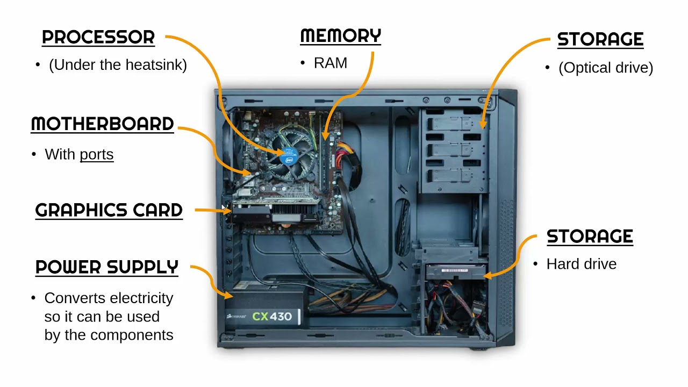
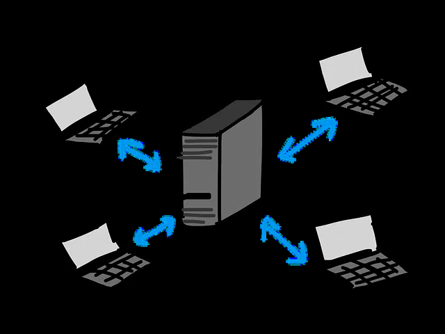
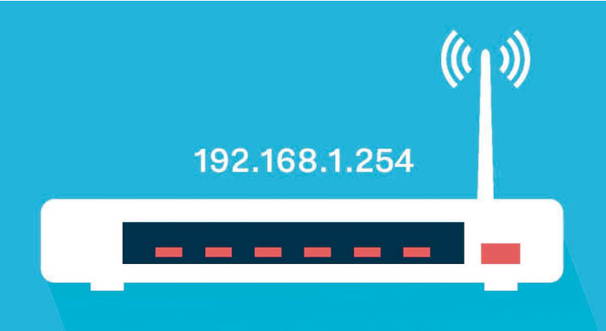
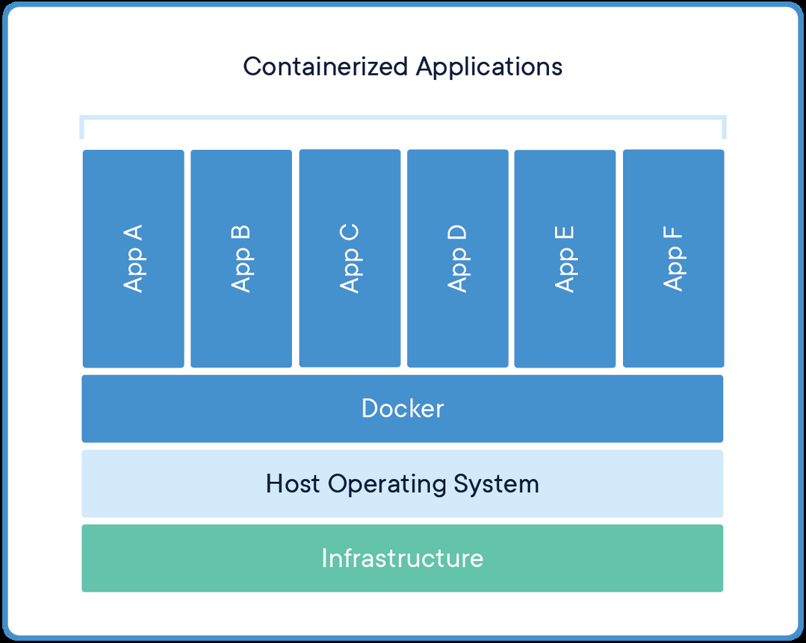
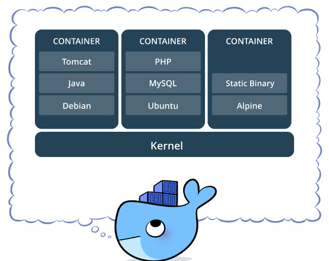

# Introducción a Docker

---

## ¿Les suena?

- ¿Qué es lo primero que piensan?
- ¿Lo usan?

---


---

# TENEMOS QUE REPASAR ALGUNAS COSITAS ANTES

---

## ¿Qué partes tiene una compu?


---

## Componentes Internos



---

## ¿Qué pasa cuando desconectamos y volvemos a conectar la compu?


---

## Procesos

*Lo pasamos muy por arriba*

- ¿Qué ven si escriben `top` en sus terminales?


---

## ¿Alguna vez jugaron Minecraft?

- ¿Qué cosas se acuerdan?
- ¿Jugaron Online?

---

## ¿Qué hace falta para jugar online?

- ¿Qué necesito para jugar con mis amigos?
- ¿Puedo jugar gratis?
- ¿En algunos casos anda mal?

---

## Estructura Cliente-Servidor

Siguiendo el ejemplo anterior...
- ¿Cuáles son los clientes y cuál es el servidor?
- ¿Cómo se hablan?



---

## ¿Qué necesito para conectarme al servidor?

¿Se acuerdan?



---

## Puertos

- ¿Suenan?
- ¿A qué nivel creen que se encuentran?
- ¿Cómo sabe mi computadora cuáles conexiones quieren hablar con el Minecraft?

Así como nuestra computadora puede tener muchos procesos, estos procesos hacen uso de puertos.

*Quédense tranquilos que con la práctica lo vamos a dejar más en claro.*

---

# ¡Recreo!
## Después del intervalo vamos a hablar de Docker

---

# Contexto histórico: ¿Cómo corríamos software antes?

---

## La era física: Bare Metal

- **Un servidor por aplicación:** Hace 25 años, si necesitabas una web y una base de datos, ponías una máquina física para cada una.
- **Desperdicio de cómputo:** La mayoría de los servidores operaban al 5% o 10% de su capacidad.
- **Dependency Hell:** Si intentabas meter varias aplicaciones en la misma máquina, una actualización de una librería compartida podía romper todas las demás.

---

## La era de la Virtualización: Máquinas Virtuales

A principios de los 2000s se popularizan las **VMs** (VMware, VirtualBox, KVM):

- Permiten correr múltiples aplicaciones aisladas en un mismo hardware físico.
- **El gran costo:** Cada máquina virtual corre un **Sistema Operativo completo (Guest OS)** con su propio kernel virtualizado.
- Gigabytes de disco para cada SO, gigabytes de memoria RAM reservada y minutos para arrancar.

---

> "¡Pero en mi máquina funciona!"
> — Cualquier desarrollador de software (circa 1995–hoy)

Desarrollás en tu computadora, todo anda de diez. Se lo pasás a producción o a tu compañero y no levanta por diferencias de versiones, librerías del sistema o variables que faltan.

*— "Bueno... ¡entonces mandemos tu máquina a producción!"*

---

## Las raíces en Linux: Namespaces y cgroups

¿Y si en vez de emular una computadora entera, aislamos los procesos adentro de Linux?

- **chroot (1979):** Enjaular el sistema de archivos de un proceso.
- **cgroups (Google, 2006):** Limitar y medir uso de CPU, memoria y disco.
- **Namespaces (2002–2008):** Aislar la vista de procesos (PID), red, usuarios y filesystems.

Eran herramientas potentísimas, pero muy difíciles y tediosas de configurar a mano.

En **2013**, nace **Docker**: empaquetó toda esta magia del kernel con imágenes en capas y cambió el desarrollo para siempre.

---

# Docker: Imágenes y Contenedores

---

## El problema de las instalaciones

Si yo les digo que se tienen que instalar Minecraft...
- ¿Por dónde arrancan?
- Necesitamos Java... ¿Qué versión?

Para este tipo de situaciones, nos viene a ayudar **Docker**.

---

## Aplicaciones Contenerizadas



---

## ¿Qué es un container?

Un container contiene el código y las dependencias necesarias para correr una aplicación de manera independiente.

*Containers isolate software from its environment and ensure that it works uniformly despite differences for instance between development and staging.*



---

<!-- slide: tipo=comparacion -->
## Máquinas Virtuales vs Contenedores

### Máquinas Virtuales (VMs)
- Virtualizan hardware completo (Hypervisor)
- Cada VM corre un SO completo (Guest OS)
- Arranque lento (minutos)
- Consumo pesado (Gigabytes de RAM y disco)

### Contenedores (Docker)
- Comparten el Kernel del sistema operativo anfitrión
- Solo contienen la aplicación y sus dependencias
- Arranque casi instantáneo (milisegundos)
- Ultralivianos (Megabytes de RAM y disco)

---

<!-- slide: tipo=comparacion -->
## Container vs Imagen: Las analogías clave

### Imagen (El Molde / La Receta)
- Plantilla estática e inmutable (de sólo lectura)
- Como una receta de cocina, el plano de una casa o una clase en POO
- Contiene: código, librerías, runtime y configuración
- Se construye una vez y se comparte en Docker Hub

### Contenedor (La Instancia / El Proceso)
- Instancia viva en ejecución de esa imagen
- Como la torta horneada, la casa construida o el objeto instanciado
- Es un proceso real de tu compu con una capa de lectura/escritura (R/W)
- Tiene ciclo de vida: podés crearlo, pausarlo, apagarlo y destruirlo

---

## De 1 Imagen a N Contenedores

Con una única imagen de base (ej: `postgres` o `nginx`):

- Podés levantar 1, 5 o 50 contenedores idénticos e independientes al mismo tiempo.
- Cada contenedor tiene su propia IP interna, sus puertos y su memoria aislada.
- Si un contenedor falla, la imagen no se modifica y los otros contenedores no se enteran.


---

## Capas y Persistencia: ¿Qué pasa si el contenedor muere?

- Las imágenes se componen de **capas de sólo lectura** (UnionFS / overlay2) que se reutilizan entre imágenes.
- El contenedor agrega una **capa de escritura efímera**: si borrás el contenedor, los archivos temporales creados adentro desaparecen.
- **¿Cómo guardamos datos que no queremos perder?**
  - Usamos **Volúmenes**: carpetas persistentes que vinculan el disco de tu computadora con el interior del contenedor.

---

# ¿Qué podemos solucionar con Docker?
## Cosas que corren dockerizadas todos los días

---

## Caso 1: Software para cámaras y videovigilancia

- **El dolor sin Docker:** Software como **MotionEye** o **Frigate** (videovigilancia con detección por IA). Requieren compilar FFmpeg con aceleración por placa de video, lidiar con OpenCV, drivers V4L2 del kernel y librerías de Python. Una actualización de tu sistema operativo rompía todo el monitoreo.
- **La solución con Docker:** Un solo comando:
  `docker run -d --device=/dev/video0 -p 8765:8765 ccrisan/motioneye`
  Todo viene empaquetado y probado. Tenés un panel web de videovigilancia grabando en 1 minuto.

---

## Caso 2: Servicios hogareños y Homelab

- **Pi-hole / AdGuard Home:** Bloqueador de publicidad y tracker a nivel DNS para todos los celulares, teles y compus de tu casa.
- **Jellyfin / Plex:** Tu propio Netflix hogareño para transmitir tus películas y música.
- **Home Assistant:** Plataforma de domótica para controlar luces, enchufes y sensores inteligentes sin depender de la nube.

---

## Caso 3: Bases de datos y desarrollo sin ensuciar la compu

- **¿Tenés que hacer el TP con Postgres, Redis o MySQL?**
  - **Antes:** Descargabas el instalador, te creaba servicios en segundo plano que arrancaban al prender la compu, ocupaban puertos y dejaban basura en el sistema.
  - **Con Docker:** `docker run -d -p 5432:5432 postgres`. Terminás la clase, corrés `docker stop` y tu máquina queda impecable.
- **Múltiples versiones:** Podés tener un proyecto viejo con Node 16 y uno nuevo con Node 22 corriendo a la vez sin conflictos.

---

## Caso 4: Servidores de juegos

- **Minecraft Server:**
  - ¿Qué Java necesita Minecraft 1.20? ¿Java 17 o Java 21? ¿Qué flags de memoria hacen falta?
  - Con Docker:
    `docker run -d -p 25565:25565 -e EULA=TRUE itzg/minecraft-server`
  - La imagen ya trae el Java exacto y optimizado para la versión del servidor.

---

# Manos a la obra: Un Coso Dockerizado

---

## ¿Cómo definimos nuestras propias imágenes?

Declarativamente usando un `Dockerfile`:

- **FROM:** Imagen base sobre la que construimos (ej. `python:3.12-alpine`)
- **WORKDIR:** Carpeta de trabajo dentro del contenedor
- **COPY:** Copia archivos de nuestra computadora al contenedor
- **RUN:** Ejecuta comandos durante la creación de la imagen (ej. instalar paquetes)
- **EXPOSE:** Documenta qué puerto escuchará el servicio
- **CMD:** Comando que arranca la aplicación al iniciar el contenedor

---

## Nuestro propio "Coso Dockerizado"

Creamos un ejemplo real en el repositorio de la materia: `ejemplos/coso-dockerizado`

- **¿Qué hace el Coso?**
  - Servidor web interactivo escrito en Python puro (ultraliviano, sin dependencias externas).
  - Muestra en tiempo real la información aislada del contenedor (Hostname/ID, SO del contenedor, memoria, uptime).
  - Incluye un probador interactivo de cámara web (software para cámaras en el navegador).

---

## El Dockerfile del Coso

```dockerfile
FROM python:3.12-alpine
WORKDIR /app
COPY app.py .
RUN adduser -D cosouser && chown -R cosouser:cosouser /app
USER cosouser
EXPOSE 8000
CMD ["python", "app.py"]
```

---

## Docker Compose: Orquestando el Coso

Para no escribir comandos largos de terminal, usamos un archivo `docker-compose.yml`:

```yaml
services:
  coso:
    build: .
    container_name: mi-coso-dockerizado
    ports:
      - "8000:8000"
    restart: unless-stopped
```

Con solo correr `docker compose up --build`, Docker construye la imagen, crea el contenedor y mapea el puerto 8000 a nuestra computadora.

---

## Comandos esenciales

- **docker compose up --build** — Construye y levanta el servicio
- **docker ps** — Lista los contenedores que se están ejecutando
- **docker logs mi-coso-dockerizado** — Muestra la salida por consola del contenedor
- **docker compose down** — Detiene y destruye los contenedores liberando recursos

---

## ¿Qué necesitamos?

### Linux
Docker Engine

### Mac
Docker Desktop

### Windows
WSL2 & Docker Desktop

---

## Tarea

- Poder correr `docker run hello-world`
- Levantar nuestro **Coso Dockerizado** (`ejemplos/coso-dockerizado`)
- Responder las siguientes preguntas:
  - ¿Qué es un volumen, para qué sirve?
  - ¿Qué es docker-compose, para qué sirve?
- Levantar la web de la Materia con Docker
- Levantar servidor de Minecraft (Extra)

**Ver para la clase que viene:**
<iframe width="560" height="315" src="https://www.youtube.com/embed/CV_Uf3Dq-EU" frameborder="0" allow="accelerometer; autoplay; clipboard-write; encrypted-media; gyroscope; picture-in-picture" allowfullscreen></iframe>

---

# GRACIAS!
## La seguimos por Slack
