<!-- slide: tipo=portada -->
# Introducción a Expresiones Regulares
Buscar, validar y transformar texto con patrones
Clase 04 — 2026

---

<!-- slide: tipo=agenda -->
## Agenda
- Patrones
- Regex
- Vamos a llevarlas a la práctica
- Comandos útiles
- Vamos a practicar
- sed

---

## ¿Cuáles de estas podrían ser bandas porteñas indie?
- Él me vendió un kg de helado
- Luis y su quinteto
- Ella se toma el 160 a Burzaco
- Manuel Camejo y sus profes de Ricota

---

## ¿Quiénes de esta lista podrían ser familiares míos? (Martinez Sastre)
- Miguel Sastre
- Claudia Martinez
- Lionel Messi
- Juan Martinez Sastre
- Hermione Granger
- Eiichiro Oda
- Lautaro Martinez
- Luciana Aymar

---

## ¿Cuáles de estas son fechas válidas?
- 09/02/1965
- 24/24/14687
- 32/otoño/2001

---

## ¿Cuáles de estas son direcciones de mail válidas?
- intro@mail.com
- hola@chicos
- tomenagua@cucucu.co
- porfa@net

---

# Patrones

---

## 1943 — Warren S. McCulloch y Walter Pitts
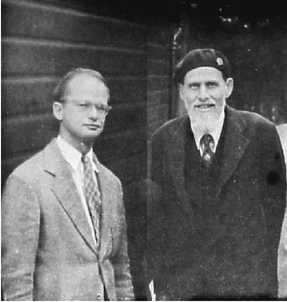

- Modelos matemáticos para representar neuronas. 
- Plantean una idea importante: podemos representar matemáticamente cómo un sistema recibe entradas y produce respuestas. Con el tiempo, autómatas.

---

## 1956 — Stephen Kleene


- Encuentra una forma matemática de describir ciertos comportamientos de esos
sistemas: los **eventos regulares**. 
- Responde a la pregunta *¿cómo describimos un comportamiento sin enumerar todos los casos posibles?* -
- Utiliza símbolos como `|` (or) y `*` (repetición).

---

## 1968 — Ken Thompson


- Trabajando en Bell Labs en los softwares previos a Unix 
- Se topa con un problema: muchas líneas de código, y buscar algo era un calvario. 
- La solución fue llevar los eventos regulares a la práctica. Nacen las expresiones regulares, *regular expressions*, o…

---

# Regex

---

<!-- slide: tipo=hasta-6-imagenes -->
## ¿Qué son?
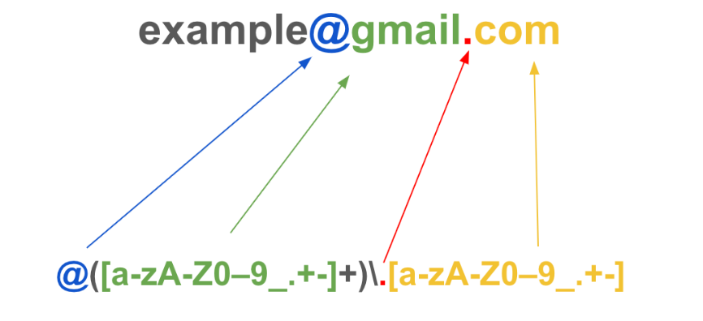


---

## ¿Para qué creen que las usamos?
Antes de meternos con la sintaxis: ¿dónde se les ocurre que aparece esto en
el día a día de alguien que programa?

---

## Es una herramienta más de las que ya tenemos
- **Buscar** dentro de un texto
- **Reemplazar** partes de un texto
- **Validar** que algo tenga el formato esperado
- **Parsear** información estructurada
- …entre muchas otras cosas

---

## Se usa en todos lados
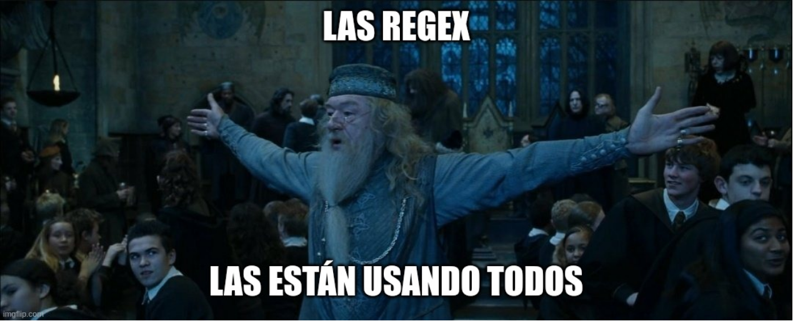

---

## ¿Dónde, concretamente?
- Validación de formularios
- Búsquedas avanzadas de texto
- Limpieza de datos a gran escala
- Debugging de servidores
- Refactorizar código

---

# Vamos a llevarlas a la práctica

---

## Caso trivial
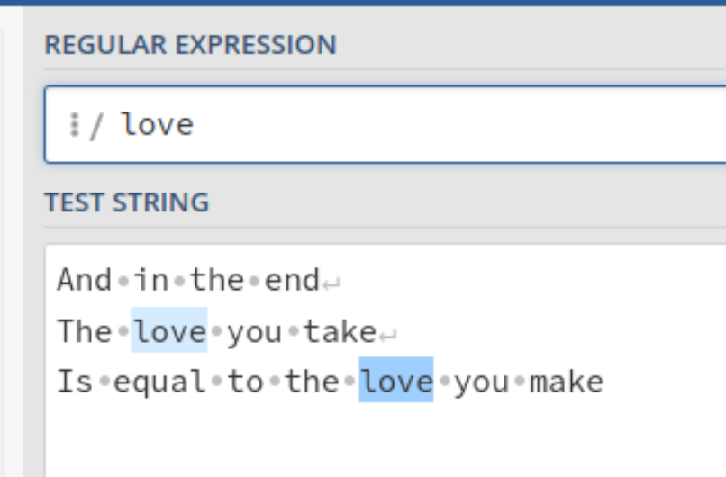

Una regex sin ningún símbolo especial es simplemente el texto literal que
buscamos. 

- Playground: https://regex101.com/

---

## OR
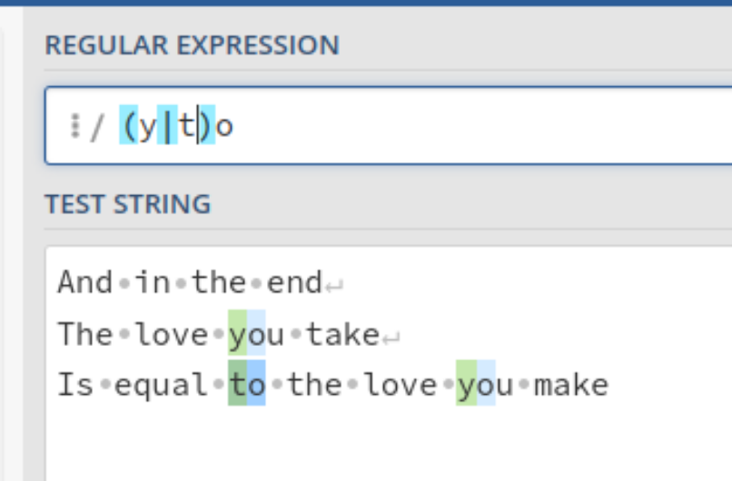

La barra `|` significa "esto **o** esto otro": `(y|t)o` matchea `yo` y `to`.

---

## OR de grupos
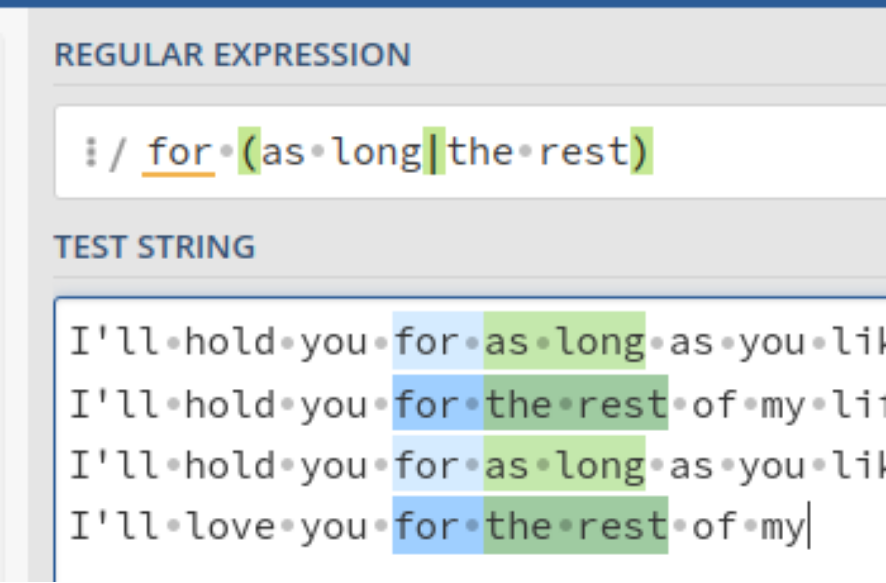

Los paréntesis agrupan: lo que está adentro se toma como una sola unidad,
así el `|` puede elegir entre frases enteras y no solo entre caracteres.

---

## Comodín
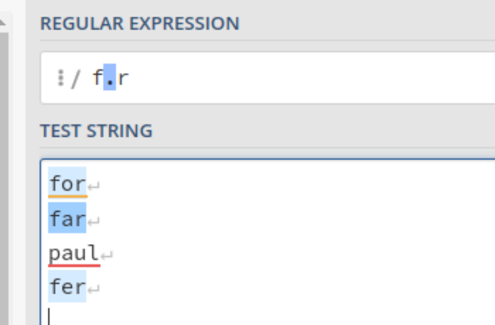

El punto `.` representa **cualquier carácter**: `f.r` matchea `far` y
`fer`, pero no `paul`.

---

## Colecciones
![la regex [cv]aso](img/coleccion.png)

Los corchetes definen un conjunto de caracteres posibles para **una sola**
posición: `[cv]aso` matchea `vaso` y `caso`, pero no `paso` ni `Vaso`.

---

<!-- slide: tipo=hasta-6-imagenes -->
## Colección vs. grupo
![[cv]aso — una c o una v](img/coleccion.png)
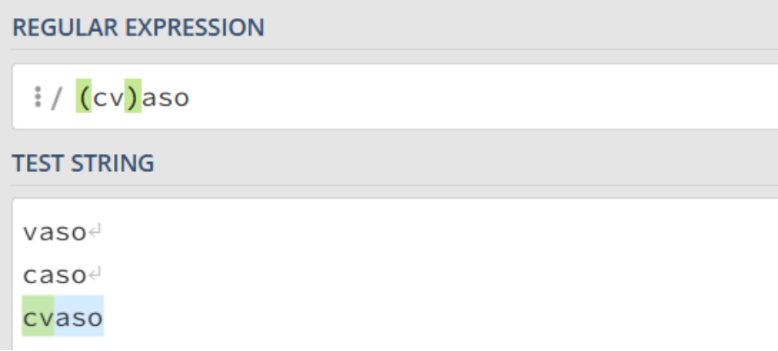

---

<!-- slide: tipo=hasta-6-imagenes -->
## Rangos
![[m-z] — el rango](img/rango.png)
![[^m-z] — el rango negado](img/rango-negado.png)

---

## Tokens
- `.` — cualquier carácter
- `\n` — carácter de nueva línea
- `\t` — carácter de tabulación
- `\s` — cualquier carácter de espacio en blanco (incluye `\t`, `\n` y otros)
- `\S` — cualquier carácter que no sea un espacio en blanco
- `\w` — cualquier carácter de palabra (letras del alfabeto latino, `0-9` y `_`)

---

## Tokens
- `\W` — cualquier carácter que NO sea de palabra (el inverso de `\w`)
- `\b` — límite de palabra: la frontera entre `\w` y `\W`
- `\B` — no-límite de palabra: el inverso de `\b`
- `^` dentro de colección — niega el contenido, complemento
- `^` fuera de colección — el inicio de una línea
- `$` — el final de una línea
- `\` — el carácter literal

---

## Cuantificadores
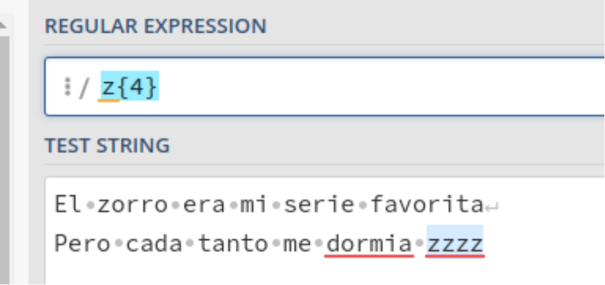

`{n}` pide exactamente `n` repeticiones: `z{4}` matchea `zzzz`.

---

## Cuantificadores
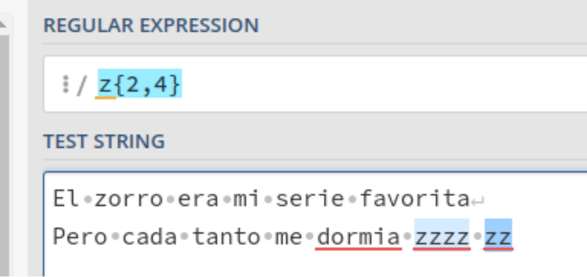

`{min,max}` pide entre `min` y `max` repeticiones: `z{2,4}` matchea tanto
`zzzz` como `zz`.

---

## Cuantificadores
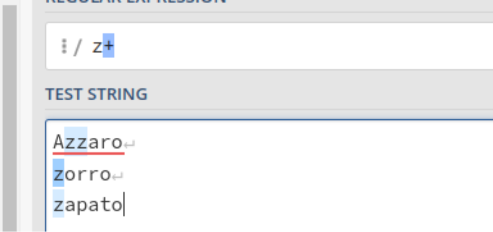

Los tres atajos que más se usan: `*` (0 o más), `+` (1 o más) y `?` (0 o 1).

---

## Anclaje
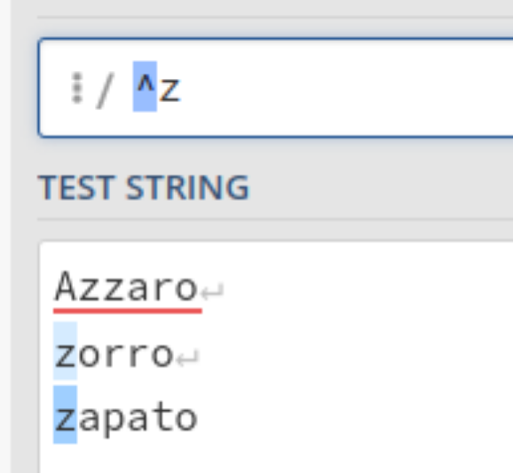

`^` principio de línea y `$` fin de línea. Sin anclas, el patrón puede
matchear en cualquier parte.

---

# Comandos útiles

---

<!-- slide: tipo=codigo -->
## grep
```bash
grep [opciones] [patron] [archivo]
```

Permite buscar patrones dentro de los archivos especificados. El `patron`
es una regex: todo lo que vimos hasta acá se puede usar acá adentro.

---

<!-- slide: tipo=hasta-6-imagenes -->
## Ejemplo básico
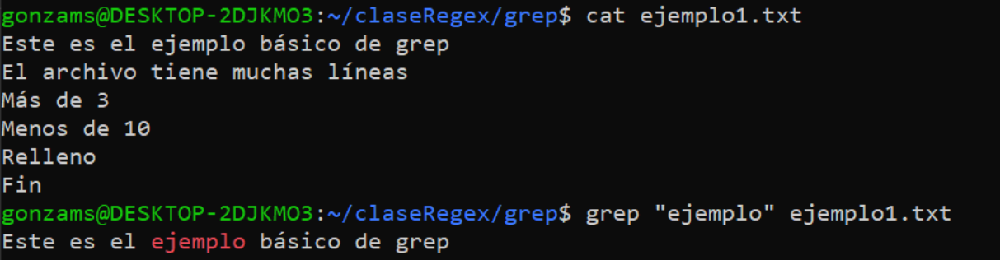
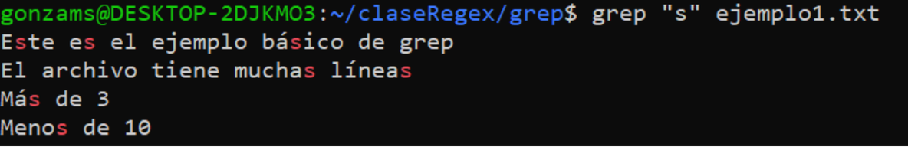

---

<!-- slide: tipo=hasta-6-imagenes -->
## ¿Qué pasa si busco "f"?


---

## Algunas opciones
- `-i` — ignora el case
- `-n` — muestra el número de línea
- `-w` — coincide solo con palabras completas, no con subcadenas
- `-v` — muestra todas las líneas que NO contienen el patrón {tag:tip}
- `-r` — busca el patrón en todos los archivos del directorio y sus subdirectorios
- `-c` — muestra el número de líneas que contienen el patrón
- `-l` — muestra solo los nombres de los archivos que contienen el patrón, no las líneas coincidentes

---

## ¿Puedo buscar en más de un archivo?


---

<!-- slide: tipo=codigo -->
## Buscar en varios archivos
```bash
grep "ejemplo" archivo1.txt archivo2.txt archivo3.csv
grep "ejemplo" *
grep "ejemplo" *.log
grep "ejemplo" ruta/a/directorio/*
grep -r "ejemplo" .
grep -r "ejemplo" ./ruta/a/directorio/
```

---

# Vamos a practicar


---

## Ejercicio 1.a — las notas de Gonza
Buscar las notas de Gonza dentro del archivo `notas.csv`.

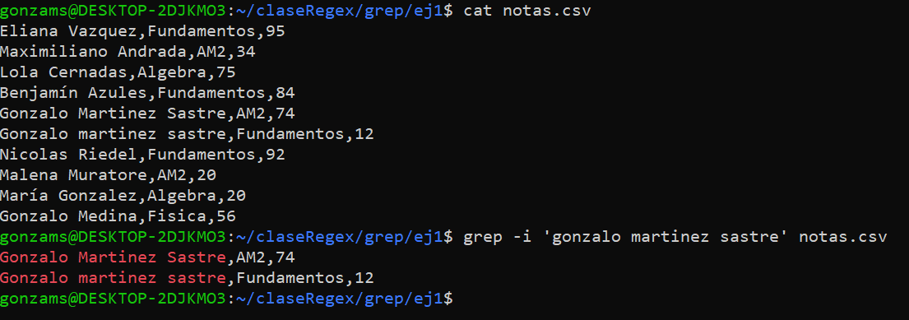

---

## Ejercicio 1.b — en todo el directorio
Buscar las notas de Gonza en todos los archivos dentro del directorio `ej1`.

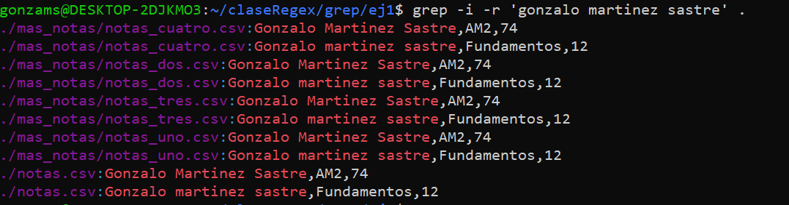

---

## Ejercicio 2 — notas mayores o iguales a 85
Dado el archivo `notas.csv`, buscar todos aquellos alumnos cuyas notas son
mayores o iguales a 85.

![grep -E '8[5-9]|9[0-9]|100' notas.csv](img/ej-grep-2.png)

---

## Ejercicio 3 — códigos postales mal escritos
Dado el listado de alumnos, buscar todos aquellos cuyo código postal no
esté bien escrito de acuerdo con el CPA (1 letra, 4 números, 3 letras).

![grep -v -E "^[^,]+,[A-Z][0-9]{4}[A-Z]{3},[^,]+$" alumnos.csv](img/ej-grep-3.png)

---

## Ejercicio 4 — alumnos de 25 a 29 años
Dado el listado de alumnos, buscar todos aquellos que tengan entre 25 y 29
años (inclusive).

![grep -E ",2[5-9],[^,]*$" alumnos.csv](img/ej-grep-4.png)

---

# sed

---

<!-- slide: tipo=codigo -->
## sed
```bash
sed [script] [archivo]
sed 's/patron/reemplazo' [archivo]
```

Es una herramienta muy poderosa para procesar y manipular texto, pero
nosotros la vamos a usar principalmente para **buscar y reemplazar**.

---

## Veámoslo en funcionamiento
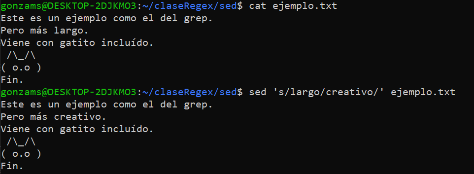

El archivo, ¿fue modificado?

---

## Algunas opciones, operaciones y modificadores
- `-i` — modifica el archivo {tag:warning}
- `-e` — concatena operaciones
- `-r` — usa expresiones regulares extendidas
- `Nd` — elimina la N-ésima línea
- `/patron/d` — elimina las líneas que matchean
- `/patron/p` — imprime las líneas que coinciden
- `s/patron/reemplazo/g` — aplica la sustitución en todas las coincidencias
- `s/patron/reemplazo/I` — ignora el case

---

## Ejercicio 1 — todas las vocales en 'a'
Sustituir todas las vocales del archivo `cancion.txt` por la letra `a`.

![sed "s/[eiou]/a/Ig" cancion.txt](img/ej-sed-1.png)

---

## Ejercicio 2.a — llevar los desaprobados a 55
Transformar la nota de todos aquellos alumnos desaprobados (nota < 55) en
un 55.

![sed -r 's/\b[0-4][0-9]\b|\b5[0-4]\b/55/g' notas.csv](img/ej-sed-2a.png)

---

## Ejercicio 2.b — ¿y si la nota tiene un solo dígito?
¿Qué sucede si las notas menores a 10 tienen un solo dígito? Adaptar la
regex.

![sed -r "s/,([0-9]|[1-4][0-9]|5[0-4])$/,55/g" notas.csv](img/ej-sed-2b.png)

---

## Ejercicio 3 — intercambiar dos alumnos
Intercambiar las notas de Gonza con las de Nico en un sólo comando.

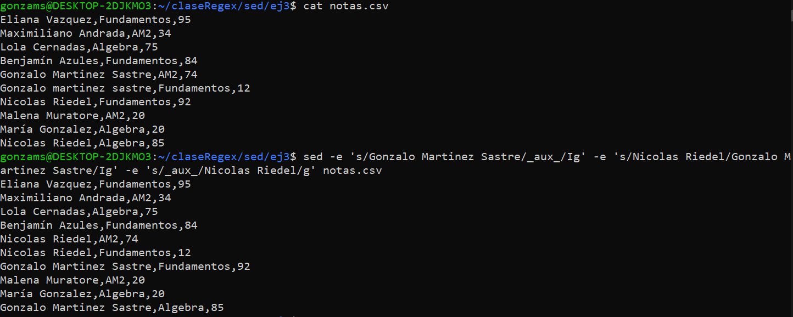

---

<!-- slide: tipo=bibliografia -->
## Referencias
1. Regular expression — Wikipedia (en.wikipedia.org/wiki/Regular_expression)
2. Regular language — Wikipedia (en.wikipedia.org/wiki/Regular_language)
3. RegEx in Python — Nikhil Kumar Singh (github.com/nikhilkumarsingh/RegEx-In-Python)
4. regexr.com — playground alternativo
5. The complete guide to regular expressions — CoderPad (coderpad.io/blog/development)
6. Regular Expressions (Regex) — YouTube (youtube.com/watch?v=ZfQFUJhPqMM)
7. sed guide by example — The Mouseless Dev (themouseless.dev/posts/sed-guide-example-mouseless)
8. grep(1) — Linux man page (linux.die.net/man/1/grep)

---

<!-- slide: tipo=cierre -->
# Gracias
Practicá en regex101.com — próxima clase: práctica de Bash y Regex
