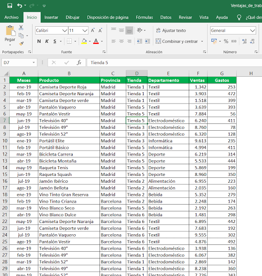
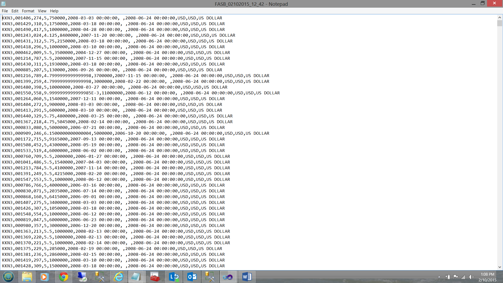
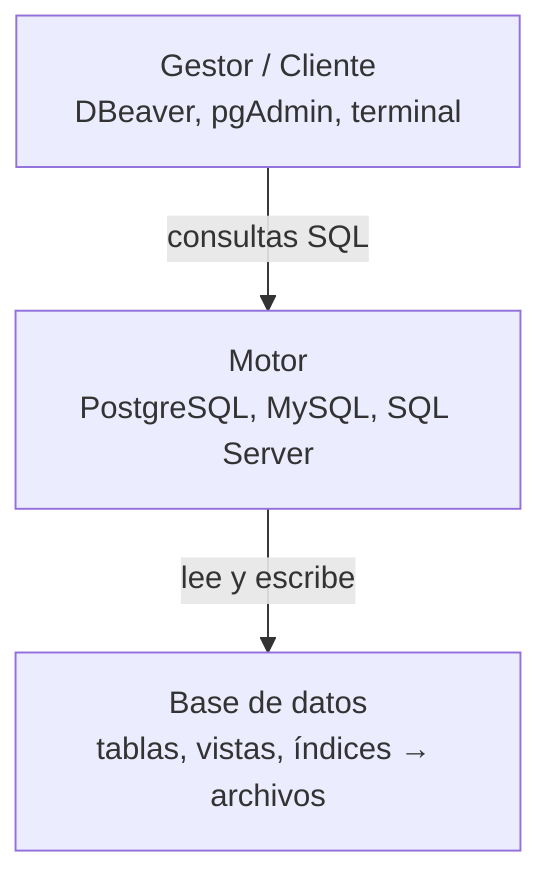

<!-- slide: tipo=portada -->
# Introducción a SQL
Bases de datos relacionales y sentencias básicas
Clase SQL 1 — 2026

---

# ¿Qué es una base de datos?

---

<!-- slide: tipo=imagen-bleed -->
## ¿Es una base de datos?


---

<!-- slide: tipo=imagen-bleed -->
## ¿Es una base de datos?



---

<!-- slide: tipo=imagen-bleed -->
## ¿Es una base de datos?


---

<!-- slide: tipo=imagen-bleed -->
## ¿Es una base de datos?


---

<!-- slide: tipo=imagen-bleed -->
## ¿Es una base de datos?


---

<!-- slide: tipo=imagen-bleed -->
## ¿Es una base de datos?


---

<!-- slide: tipo=imagen-bleed -->
## ¿Es una base de datos?



---

<!-- slide: tipo=imagen-bleed -->
## ¿Es una base de datos?


---

<!-- slide: tipo=comparacion -->
## Repasemos

### Sí
- Planilla de Excel: columnas definidas, se puede ordenar y filtrar
- Fichero de biblioteca: ordenado, se busca rápido
- Contactos del celular: cada contacto con los mismos campos, buscador
- Un CSV: sí, **si se usa bien** (mismas columnas en todas las filas, una fila por registro)

### No
- El cuaderno: tiene información, pero no está organizada ni facilita buscar
- Los tickets en el cajón: son datos, pero amontonados

---

## ¿Qué tienen en común las que sí?

- La información está **organizada** de una forma que se conoce de antemano
- Gracias a eso se puede **buscar, recuperar y modificar** fácilmente

---

## Base de Datos

- **Almacenamiento organizado** de información
- Facilitan la **búsqueda, recuperación y gestión** de datos
- Son esenciales para las aplicaciones web

No todo conjunto de datos es una base de datos {tag:tip}

---

## Las partes de una base de datos



- **Base de datos:** la información propiamente dicha (al final, son archivos)
- **Motor:** el encargado de guardar y trabajar con esa información
- **Gestor/Cliente:** la interfaz que nos ayuda a hablar con el motor

---

## Motores más usados

- **PostgreSQL** — open source, potente y flexible. Es la base de datos más usada según la encuesta de Stack Overflow 2025: la usa el **55,6 %** de los desarrolladores {tag:tip}
- **MySQL** — open source, hoy mantenida por Oracle. Segunda en la misma encuesta (**40,5 %**). Es la base de WordPress, que a su vez está detrás de gran parte de los sitios web. 
- **SQL Server** — de Microsoft; la usan empresas que ya pagan licencias de Microsoft

¿Cuál vamos a usar nosotros? **PostgreSQL**.

---

## Gestor de bases de datos

- **DBeaver** — multiplataforma: funciona con PostgreSQL, MySQL, SQL Server y otros motores. Interfaz amigable
- **pgAdmin** — pensado específicamente para PostgreSQL
- **MySQL Workbench** — pensado específicamente para MySQL
- **Clientes de terminal** — cada motor trae el suyo: `psql` (PostgreSQL), `mysql` (MySQL), `sqlcmd` (SQL Server) {tag:tip}

---

## ¿Por qué surgieron?

- **Volumen:** ¿cuánto ocupa guardar nombre y apellido de **todos los argentinos**? ~20 bytes × 46 millones ≈ 1 GB, solo de nombres
- **Búsqueda:** y encontrar a una persona entre 46 millones... ¿leyendo de a una?
- **Muchos usuarios a la vez:** un banco no puede tener un solo empleado mirando el libro de cuentas
- **Consistencia:** si dos cajeros modifican la misma cuenta al mismo tiempo, ¿cuál gana?

Los archivos sueltos no resolvían nada de esto.

---

<!-- slide: tipo=imagen-texto -->
## Antes de las bases de datos: el papel


- Libros contables, fichas y carpetas guardadas en cajones y estanterías
- Para encontrar un dato había que ir hasta el archivo y buscarlo a mano
- Copiar, ordenar o cruzar información llevaba días

---

<!-- slide: tipo=imagen-texto -->
## 1890: tarjetas perforadas


- Cada tarjeta es **un registro**: una persona, una venta, un empleado
- Los datos se codifican con **agujeros** en posiciones fijas: la posición del agujero indica el valor
- Una máquina lee las tarjetas haciendo pasar corriente por los agujeros, y cuenta o clasifica automáticamente
- Herman Hollerith las usó para procesar el **censo de EE.UU. de 1890**. Su empresa terminaría siendo **IBM**
- Para buscar un registro había que pasar **todo el mazo** por la máquina

---

<!-- slide: tipo=imagen-texto -->
## Años 50: cintas magnéticas


- Los datos se graban **uno detrás de otro** sobre una cinta magnetizada
- Se leen **en orden**, de principio a fin: para encontrar un registro había que recorrer toda la cinta
- Para modificar un dato, en general había que **reescribir la cinta entera** en otra cinta

---

## Años 60: las primeras bases de datos
- Aparecen los **discos**: se puede saltar directo a cualquier parte de los datos
- Surgen las primeras bases de datos (por ejemplo, IMS de IBM, usada en el **programa Apolo**)
- Para consultar, el programa tenía que indicar **el camino**: ir de registro en registro siguiendo los enlaces entre ellos

---

## Años 70 y 80: la revolución relacional
// no menciona cuando aparece sql
// me quedaria aca, quiero aprovechar esto para explicar el modelo relacional
- **1970 — Edgar F. Codd** (IBM) publica el **modelo relacional**: los datos se guardan en **tablas**, y uno pide *qué* quiere, no *cómo* buscarlo
- **1974 — Nace SQL** (en ese momento, SEQUEL) en IBM: el lenguaje para pedirle datos a ese modelo
- **1974 — System R** (IBM) e **Ingres** (Berkeley): los primeros prototipos relacionales
- **1979 — Oracle** lanza la primera base de datos relacional comercial con SQL
- **1986 — SQL se vuelve estándar** (ANSI): el mismo lenguaje sirve para distintos motores
- **1986 — Postgres** nace en Berkeley como sucesor de Ingres

---

## De la web a hoy (reveer)
// no
- **1995 — MySQL**, **1996 — PostgreSQL**: open source y gratis, justo cuando explota la web
- **2000 — SQLite**: una base de datos entera en un archivo. Hoy está en todos los celulares
- **2006–2009 — NoSQL:** Google, Amazon y Facebook manejan datos a una escala nunca vista. Aparecen MongoDB, Redis, Cassandra...
- **Hoy:** las relacionales siguen siendo las más usadas. PostgreSQL encabeza las encuestas de desarrolladores de Stack Overflow {tag:info}

---

## ¿Qué es una base de datos relacional?

- Organiza los datos en **tablas**: filas y columnas
- Cada tabla guarda **un tipo de cosa**: deportistas, sedes, deportes...
- Cada fila se identifica de forma **única** (con un `id`)
- Las tablas se pueden **vincular** entre sí *(lo vemos la clase que viene)*

---

## ¿Por qué se llama *relacional*?

Codd se basó en la matemática: a una tabla la llamó **relación**, porque cada fila **relaciona** valores que van juntos.

| nombre | apellido | país | deporte |
|---|---|---|---|
| Pascual | Di Tella | Argentina | Esgrima |

Esta fila dice: *"Pascual" va con "Di Tella", con "Argentina" y con "Esgrima"*. Esa combinación **es** la relación.

---
// no
## ¿Qué es una entidad?


Un **concepto del problema** del que queremos guardar información:

- Hay **muchos** del mismo tipo
- Cada uno se **distingue** de los demás
- Se describe con **atributos**

En una base relacional:

- **Entidad** → tabla (`deportistas`)
- **Atributo** → columna (`nombre`, `pais`, `deporte`)
- **Instancia** → fila (Pascual Di Tella, Macarena Ceballos, Julieta Lucas...)

---
// no
## ¿Qué NO es una entidad?

- **Un atributo:** el país o el deporte *describen* a un deportista → son columnas, no tablas
- **Una instancia:** Julieta Lucas no es una entidad, es **una fila** de `deportistas`
- **Algo que hay uno solo:** "el sistema", "la aplicación", "la ceremonia inaugural"
- **Un valor calculado:** "cantidad de deportistas argentinos" → se obtiene consultando, no se guarda aparte
- **Una acción suelta:** "buscar", "insertar" → es lo que hacemos *con* los datos

---
// no
## ¿Entidad o atributo? Depende

¿El **país** es una entidad o un atributo?

- Si solo nos importa el nombre → **atributo**: `pais VARCHAR(50)` en `deportistas`
- Si queremos guardar datos *del país* (código, bandera, medallero...) → **entidad**: tabla `paises`

La pregunta clave: **¿necesito guardar información sobre esto?** {tag:tip}

¿Y un deporte? ¿Y una sede? ¿Y una medalla? ¿Y un equipo como Las Leonas?

---

# SQL

---

## ¿Qué es SQL?

**Structured Query Language** — Lenguaje de Consultas Estructurado.

Es el lenguaje **estándar** para gestionar bases de datos relacionales. 
Nos da un estándar para hablarle a una base de datos.

---

## ¿Qué nos permite hacer?

- Crear y modificar bases de datos 
- Definir la estructura de las tablas
- Insertar, modificar y eliminar datos 
- **Consultar información de manera eficiente** {tag:tip}

Como con Git: hay comandos que se usan una vez por proyecto y otros que se usan cotidianamente.

---

## Un poco de historia de SQL

- **1974:** Donald Chamberlin y Raymond Boyce (IBM) lo diseñan para System R. Se llamaba **SEQUEL**
- Se le cambia el nombre a **SQL** por un problema de marca registrada
- **1986:** se vuelve estándar ANSI
- **Hoy:** el estándar se sigue actualizando, y casi todo lo que está hecho sigue usando SQL

---

## SQL está en todos lados

- **SIU Guaraní** — el sistema de inscripciones de la facultad funciona sobre PostgreSQL
- **Instagram** — nació y creció sobre PostgreSQL
- **Facebook, YouTube y Wikipedia** — usan MySQL (o su derivado MariaDB) a escala enorme
- **WhatsApp, y casi cualquier app del celular** — guardan los datos localmente en SQLite
- **Chrome y Firefox** — el historial y los marcadores del navegador están en SQLite

---

<!-- slide: tipo=comparacion -->
## SQL vs PostgreSQL

### SQL
- Es el **lenguaje**
- Lo estándar funciona en cualquier motor

### PostgreSQL
- Es el **motor**
- Agrega sintaxis propia que puede no funcionar en otros motores

---

# Comandos básicos

---

## Crear y borrar una base de datos

```sql
CREATE DATABASE suramericanos;

DROP DATABASE suramericanos;
```

- Toda sentencia termina con **punto y coma** `;`
- `CREATE DATABASE` se utiliza muy pocas veces (una por proyecto)
- `DROP DATABASE` borra la base **con todas sus tablas** {tag:danger}

---

## Tablas

Una tabla es una **matriz de doble entrada**:

- **Columnas:** los atributos (nombre, apellido, ciudad...)
- **Filas:** los datos. Cada fila es un **registro** (*record*)

---

## Crear una tabla

```sql
CREATE TABLE clientes (
    id INT,
    nombre VARCHAR(50),
    apellido VARCHAR(50)
);
```

- `CREATE TABLE` → palabras reservadas
- `clientes` → nombre de la tabla (en general en **plural**)
- Entre paréntesis: `nombre_columna TIPO`, separadas por coma
- Esto crea la **estructura**: todavía no hay datos

---

## Tipos de datos

- **Números enteros:** `INT` (o `INTEGER`), `SMALLINT`, `BIGINT` para valores muy grandes
- **Números con decimales:** `DECIMAL(10, 2)` para valores exactos como precios; `REAL` para aproximados
- **Texto:** `VARCHAR(50)` → hasta 50 caracteres (*variable character*); `CHAR(3)` → largo fijo (ej. código de país `ARG`); `TEXT` → sin límite
- **Booleanos:** `BOOLEAN`
- **Fechas y horas:** `DATE` (`'2026-09-12'`), `TIME`, `TIMESTAMP` (fecha + hora)

---

## Insertar datos: `INSERT`

```sql
INSERT INTO clientes (id, nombre, apellido)
VALUES (1, 'Juan', 'Pérez');
```

- Inserta una **fila nueva** en la tabla
- Entre paréntesis indicamos **qué columnas** llenamos y **en qué orden**
- Se pueden omitir columnas que acepten nulos

---

## Borrar filas: `DELETE`

```sql
DELETE FROM clientes WHERE id = 1;
```

- Borra **todas** las filas que cumplan la condición del `WHERE`
- La fila no queda vacía: **deja de existir**
- `WHERE nombre = 'Santiago'` → ¿cuántos Santiagos hay? Los borra a todos
- No hay Ctrl+Z en SQL {tag:danger}

---

## Modificar filas: `UPDATE`

```sql
UPDATE clientes
SET apellido = 'García'
WHERE id = 2;
```

- Se lee casi en castellano: *"modificá clientes, poné apellido García donde el id sea 2"*
- `SET` dice **qué** cambia, `WHERE` dice **a quién**
- Si nos olvidamos del `WHERE`... **todas** las filas pasan a llamarse García {tag:danger}

---

## Consultar: `SELECT`

El comando más usado. Tiene tres partes:

- **`SELECT`** → qué columnas quiero ver
- **`FROM`** → de qué tabla(s)
- **`WHERE`** → cómo filtro (opcional)

```sql
SELECT * FROM clientes;

SELECT nombre, apellido FROM clientes WHERE ciudad = 'Madrid';
```

- `*` es un comodín: "todas las columnas"
- La lógica del `WHERE` es la misma en `SELECT`, `UPDATE` y `DELETE`


---

# Manos a la obra: levantando Postgres

---

## Opciones para trabajar con PostgreSQL

- **En línea:** un entorno de SQL en el navegador, sin instalar nada
- **Docker + terminal:** PostgreSQL en un contenedor, y consultas con `psql`
- **Docker + gestor gráfico:** el mismo contenedor, y consultas desde DBeaver

La opción en línea sirve para practicar, pero **no alcanza para el TP final** {tag:warning}

---
## ¿Por qué Postgres en Docker?

- Cada proyecto puede usar una **versión distinta** de Postgres, y conviven sin conflicto en distintos puertos
- **Mismo entorno para todo el equipo:** misma versión y misma configuración
- **La configuración queda en un archivo** (`docker-compose.yml`) que se versiona con Git junto al proyecto
- **Configuración inicial automática:** el usuario, la contraseña y la base se crean solos al levantar el contenedor {tag:tip}

---

## El `docker-compose.yml`

```yaml
services:
  postgres:
    image: postgres:18
    ports:
      - "5432:5432"
    volumes:
      - pgdata:/var/lib/postgresql
    environment:
      POSTGRES_USER: postgres
      POSTGRES_PASSWORD: postgres
      POSTGRES_DB: suramericanos

volumes:
  pgdata:
```

Variables de entorno disponibles: https://hub.docker.com/_/postgres#environment-variables


---

## Levantarlo y entrar por terminal
```bash
docker compose up -d
docker ps
docker exec -it <container> bash
psql -U postgres -d suramericanos
```

O directo, sin pasar por bash:

```bash
docker exec -it <container> psql -U postgres -d suramericanos
```

- Podemos usar el **nombre** del contenedor en vez del ID (el ID cambia) {tag:tip}
- ¿Y la contraseña? Dentro del contenedor, la imagen confía en las conexiones locales y no la pide. Desde afuera (por ejemplo, DBeaver) sí la pide {tag:note}

---

## Comandos útiles de `psql`

- `\l` — lista las bases de datos
- `\c suramericanos` — se conecta a una base
- `\dt` — lista las tablas
- `\d deportistas` — describe una tabla
- `\q` — sale

En la terminal, **sin `;` la sentencia no se ejecuta** {tag:warning}

---

# Práctica: Juegos Suramericanos Santa Fe 2026

---

## Están pasando ahora

- **12 al 26 de septiembre de 2026**, organizados por la provincia de Santa Fe
- **Sedes principales:** Rosario (35 disciplinas y la ceremonia inaugural), Santa Fe y Rafaela
- **Subsedes:** Paraná (softbol), Mar del Plata (surf) y CABA (bolos)
- **43 deportes**, y Argentina compite con **658 atletas**

¿Cómo guardarían toda esta información? {tag:info}

---
## Diseñemos las tablas

¿Qué **tablas** necesitamos? ¿Qué **columnas** tiene cada una?

### Deportistas
- nombre, apellido
- país, deporte
- prueba (ej. sable individual)

### Sedes
- ciudad, provincia
- cantidad de disciplinas
- *qué deportista compite en qué sede y qué medallas gana → la clase que viene (relaciones)*

---

## ¿Cómo identificamos cada fila?

- ¿El apellido? Pascual e Isabel Di Tella son dos medallistas distintos
- ¿El nombre y apellido? Puede haber dos deportistas que se llamen igual
- Casi nunca los datos "del problema" garantizan ser únicos
- **Siempre** vamos a necesitar identificar unívocamente cada registro
- Estándar: agregar una columna **`id`** {tag:tip}

---

## ¿Qué es una clave primaria?

La **primary key (PK)** es el atributo que elegimos para **identificar unívocamente** a cada fila de una tabla.

Si conocemos el valor de la PK, conocemos **exactamente una fila**, sin ambigüedad.

- En la vida real ya las usamos: el **CUIL** de una persona, el **legajo** en FIUBA, la **patente** de un auto
- Buscamos al alumno con legajo 112233 → hay uno solo
- Buscamos al alumno que se llama Santiago → ¿cuál de todos?

---

## ¿Qué tiene que cumplir una PK?

- **Única:** no puede haber dos filas con el mismo valor
- **Obligatoria:** ninguna fila puede no tenerla (nunca `NULL`)
- **Estable:** no debería cambiar con el tiempo — otras tablas la van a usar para referirse a esa fila {tag:warning}
- **Una sola por tabla:** puede haber muchos datos únicos, pero **uno solo** es *el* identificador

---

<!-- slide: tipo=comparacion -->
## Clave natural vs clave artificial

### Natural
- Un dato **del problema** que ya es único: CUIL, patente, legajo
- Tiene significado propio
- Riesgo: ¿y si cambia? ¿y si aparece un repetido? ¿y si alguien no lo tiene?

### Artificial (`id`)
- Un número que **inventamos** solo para identificar
- No significa nada fuera de la base
- Nunca cambia y nunca se repite → **la opción más usada** {tag:tip}

---

## Primera versión

```sql
CREATE TABLE deportistas (
    id INT,
    nombre VARCHAR(50),
    apellido VARCHAR(50),
    pais VARCHAR(50),
    deporte VARCHAR(50),
    localidad VARCHAR(100)
);
```

¿Qué problemas tiene? ¿Puede un deportista no tener nombre? ¿Dos deportistas con el mismo `id`?

---

## ¿Qué es una constraint?

Una **restricción** que le ponemos a una columna (o a la tabla) y que **el motor hace cumplir**:

- Si un `INSERT` o `UPDATE` la viola, el motor **rechaza la operación** y devuelve un error
- Protegen la **integridad** de los datos: nada inválido entra a la tabla
- SQL no adivina qué columnas deben ser únicas u obligatorias: **se lo tenemos que decir** {tag:warning}

Las que vemos hoy: `NOT NULL`, `UNIQUE`, `PRIMARY KEY`
La clase que viene: `FOREIGN KEY` (para vincular tablas) {tag:info}

---

## Agregando constraints: `NOT NULL` y `PRIMARY KEY`

```sql
DROP TABLE deportistas;

CREATE TABLE deportistas (
    id INT PRIMARY KEY,
    nombre VARCHAR(50) NOT NULL,
    apellido VARCHAR(50) NOT NULL,
    pais VARCHAR(50) NOT NULL,
    deporte VARCHAR(50) NOT NULL,
    localidad VARCHAR(100)
);
```

- `NOT NULL` → la columna es **obligatoria**
- `PRIMARY KEY` → el identificador de cada fila
- `localidad` queda opcional: puede ser `NULL`

---

## `UNIQUE`

El valor **no se puede repetir** entre filas, pero no es el identificador de la tabla:

```sql
CREATE TABLE usuarios (
    id INT PRIMARY KEY,
    email VARCHAR(100) UNIQUE NOT NULL,
    nombre VARCHAR(50) NOT NULL
);
```

- Dos usuarios no pueden tener el mismo email...
- ...pero a cada fila la identificamos por su `id`
- Una tabla puede tener **varias** columnas `UNIQUE`

---

<!-- slide: tipo=comparacion -->
## `UNIQUE` vs `PRIMARY KEY`

### UNIQUE
- El valor no se puede repetir entre filas
- Acepta `NULL` (salvo que le agreguemos `NOT NULL`)
- Una tabla puede tener varias

### PRIMARY KEY
- Es `UNIQUE` + `NOT NULL`
- Es **el** identificador de la fila: la usan otras tablas para referenciarla
- **Una sola por tabla**

---

## Otra forma de escribirlas

Las constraints también se pueden declarar al final, **con nombre propio**:

```sql
CREATE TABLE usuarios (
    id INT,
    email VARCHAR(100) NOT NULL,
    nombre VARCHAR(50) NOT NULL,
    CONSTRAINT pk_usuarios PRIMARY KEY (id),
    CONSTRAINT email_unico UNIQUE (email)
);
```

- Hay muchas formas de escribir lo mismo: busquen la sintaxis **de su motor** {tag:tip}
- Si no les ponemos nombre, Postgres genera uno automáticamente (ej. `deportistas_pkey`)

---

## Insertemos deportistas

```sql
INSERT INTO deportistas (id, nombre, apellido, pais, deporte, prueba)
VALUES (1, 'Pascual', 'Di Tella', 'Argentina', 'Esgrima', 'Sable individual');

INSERT INTO deportistas (id, nombre, apellido, pais, deporte, prueba)
VALUES (2, 'Macarena', 'Ceballos', 'Argentina', 'Natación', '100 metros pecho');

INSERT INTO deportistas (id, nombre, apellido, pais, deporte, prueba)
VALUES (3, 'Julieta', 'Lucas', 'Argentina', 'Gimnasia', 'All around');
```

¿Qué pasa si insertamos dos veces con `id = 1`? {tag:info}

---

## Constraints en acción

```sql
INSERT INTO deportistas (id, nombre, apellido, pais, deporte)
VALUES (1, 'Pascual', 'Di Tella', 'Argentina', 'Esgrima');
```
```
ERROR: duplicate key value violates unique constraint "deportistas_pkey"
DETAIL: Key (id)=(1) already exists.
```

```sql
INSERT INTO deportistas (id, apellido, pais, deporte)
VALUES (7, 'Kalejman', 'Argentina', 'Ciclismo');
```
```
ERROR: null value in column "nombre" of relation "deportistas"
violates not-null constraint
```

Los errores dicen **qué constraint** se violó y **con qué valor** {tag:tip}

---

## Completemos la delegación

```sql
INSERT INTO deportistas (id, nombre, apellido, pais, deporte, prueba)
VALUES (4, 'Micaela', 'Levaggi', 'Argentina', 'Atletismo', '1500 metros');

INSERT INTO deportistas (id, nombre, apellido, pais, deporte, prueba)
VALUES (5, 'Alejo', 'Suter', 'Argentina', 'Escalada', 'Boulder');

INSERT INTO deportistas (id, nombre, apellido, pais, deporte, prueba)
VALUES (6, 'Lucía', 'Falasca', 'Argentina', 'Vela', 'ILCA 6');
```

- Por ahora el `id` lo incrementamos **a mano** — luego veremos cómo hacerlo automático {tag:note}

---

## Algunas consultas

```sql
SELECT * FROM deportistas;

SELECT nombre, apellido FROM deportistas WHERE deporte = 'Esgrima';

SELECT nombre, apellido, prueba FROM deportistas WHERE deporte = 'Natación';
```

---

# Cierre

---

## Para la clase que viene

- **Relacionar tablas:** qué deportista compite en qué sede y qué medallas ganó, sin repetir su información
- IDs automáticos (sin tener que incrementarlos a mano)
- Consultas más complejas, ordenar resultados

---

## Tarea

- Levantar Postgres con el `docker-compose.yml` (lo subimos al Slack)
- Replicar la clase: crear `deportistas`, insertar, actualizar, consultar
- Crear la tabla **`sedes`** y cargar las 6 sedes de los Juegos
- Si no llegan con Docker: practicar en un playground online
---

## ¿Dónde consultar dudas?

- **W3Schools — SQL Tutorial:** https://www.w3schools.com/sql/ — bien explicado, buenos ejemplos y se puede probar online {tag:tip}
- **W3Schools — PostgreSQL Tutorial:** https://www.w3schools.com/postgresql

---

<!-- slide: tipo=bibliografia -->
## Bibliografía

1. SQL Tutorial (https://www.w3schools.com/sql/)
2. PostgreSQL Tutorial (https://www.w3schools.com/postgresql/)
3. Imagen oficial de Postgres — variables de entorno (https://hub.docker.com/_/postgres)
4. Documentación de PostgreSQL (https://www.postgresql.org/docs/)
5. E. F. Codd — *A Relational Model of Data for Large Shared Data Banks* (Communications of the ACM, 1970)

---

<!-- slide: tipo=cierre -->
# GRACIAS!
## La seguimos por Slack
