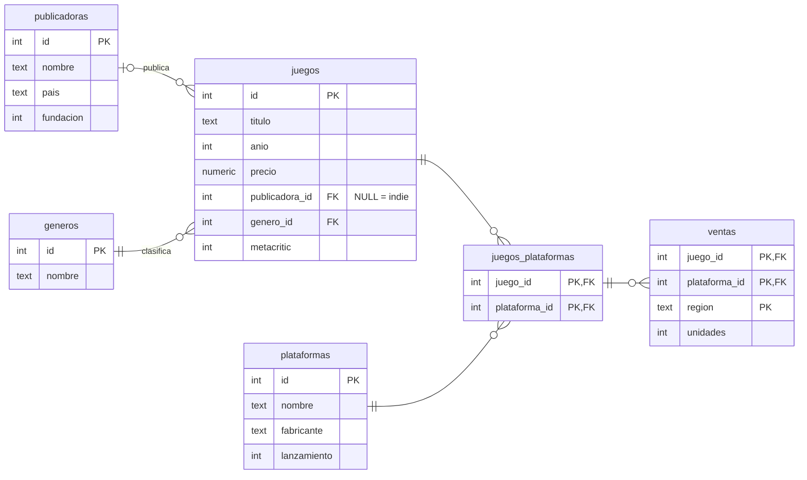

<!-- slide: tipo=portada -->
# SQL – JOINs
Relacionando tablas: de conjuntos a consultas
Clase SQL 2 — 2026

---

# Dónde quedamos

---

## La clase pasada

- Bases de datos relacionales: **tablas**, filas y columnas
- `CREATE TABLE`, `INSERT`, `UPDATE`, `DELETE` y `SELECT ... WHERE`
- Constraints: `NOT NULL`, `UNIQUE`, `PRIMARY KEY`
- Quedaron pendientes: **IDs automáticos** y **relacionar tablas** {tag:info}

---

## IDs automáticos: `SERIAL`

```sql
CREATE TABLE publicadoras (
    id SERIAL PRIMARY KEY,
    nombre TEXT NOT NULL UNIQUE,
    pais TEXT NOT NULL,
    fundacion INTEGER NOT NULL
);

INSERT INTO publicadoras (nombre, pais, fundacion)
VALUES ('Nintendo', 'Japón', 1889);   -- el id (1) lo pone Postgres
```

- `SERIAL` es un entero que Postgres **incrementa solo** en cada `INSERT`
- No pasamos el `id`: se lo dejamos al motor {tag:tip}
- También existe `GENERATED ALWAYS AS IDENTITY`, la versión del estándar SQL {tag:note}

---

## Relacionar tablas: `FOREIGN KEY`

```sql
CREATE TABLE juegos (
    id SERIAL PRIMARY KEY,
    titulo TEXT NOT NULL,
    anio INTEGER NOT NULL,
    precio NUMERIC(6, 2) NOT NULL,
    publicadora_id INTEGER REFERENCES publicadoras(id),
    genero_id INTEGER NOT NULL REFERENCES generos(id),
    metacritic INTEGER
);
```

- `publicadora_id` **apunta** a una fila de `publicadoras`: es una **clave foránea** (FK)
- En vez de repetir "Nintendo, Japón, 1889" en cada juego, guardamos solo el `1`
- Acepta `NULL`: un juego puede **no tener** publicadora (indies autopublicados)

---

## La FK se hace cumplir

```sql
INSERT INTO juegos (titulo, anio, precio, publicadora_id, genero_id)
VALUES ('Juego trucho', 2026, 10, 99, 1);
```
```
ERROR: insert or update on table "juegos" violates foreign key constraint "juegos_publicadora_id_fkey"
DETAIL: Key (publicadora_id)=(99) is not present in table "publicadoras".
```

- No podemos apuntar a una publicadora que **no existe** {tag:tip}
- Es la misma idea que `NOT NULL` o `UNIQUE`: el motor protege la **integridad**

---

## El problema de hoy

```sql
SELECT titulo, anio, publicadora_id
FROM juegos
WHERE anio = 2023;
```
```
                  titulo                   | anio | publicadora_id
-------------------------------------------+------+----------------
 The Legend of Zelda: Tears of the Kingdom | 2023 |              1
 EA Sports FC 24                           | 2023 |              2
 Resident Evil 4                           | 2023 |              6
 Street Fighter 6                          | 2023 |              6
 Counter-Strike 2                          | 2023 |              7
```

¿Quién es la publicadora `6`? Los datos están **repartidos** en varias tablas: hay que **juntarlos** con `JOIN`.

---

# Un poco de conjuntos

---

## ¿Por qué conjuntos?

- Codd armó el modelo relacional sobre **matemática**: una tabla es un **conjunto de filas**
- Las operaciones entre tablas son, en el fondo, operaciones entre **conjuntos**
- Si entendemos unión, intersección, diferencia y producto cartesiano, los JOINs salen solos {tag:tip}

Ejemplo: **A** = los juegos que tengo yo, **B** = los que tiene mi amiga.

---

<!-- slide: tipo=imagen-texto -->
## Unión: A ∪ B


- Todo lo que está en **A**, en **B** o en los dos
- A ∪ B = { Celeste, Portal 2, Minecraft, Hollow Knight, Undertale }
- Lo que está en los dos aparece **una sola vez**

---

<!-- slide: tipo=imagen-texto -->
## Intersección: A ∩ B


- Lo que está en **A** y **también** en **B**
- A ∩ B = { Minecraft, Hollow Knight }
- Los juegos que tenemos **los dos**

---

<!-- slide: tipo=imagen-texto -->
## Diferencia: A − B


- Lo que está en **A** pero **no** en **B**
- A − B = { Celeste, Portal 2 }
- El orden importa: B − A = { Undertale } {tag:warning}

---

<!-- slide: tipo=imagen-texto -->
## Producto cartesiano: A × B


- **Todas las combinaciones** de un elemento de A con uno de B
- Si A tiene 2 elementos y B tiene 3 → 2 × 3 = **6 pares**
- El resultado ya no son elementos sueltos: son **pares** (a, b)

---

<!-- slide: tipo=comparacion -->
## Dos formas de combinar tablas

### UNION / INTERSECT / EXCEPT
- Combinan **resultados** que tienen las **mismas columnas**
- **Apilan** filas (una debajo de la otra)
- Son la unión, intersección y diferencia "literales" de SQL

### JOIN
- Combina filas de **tablas distintas**
- **Pega** columnas (una fila al lado de la otra)
- Parte del **producto cartesiano** y se queda con los pares que cumplen una condición → es lo que vemos hoy {tag:tip}

---

# Nuestro dataset: videojuegos

---

## El modelo



---

## Las tablas

- **publicadoras** (9): Nintendo, EA, Ubisoft, Rockstar, CD Projekt, Capcom, Valve, Mojang, Paradox
- **juegos** (28): cada uno con **una** publicadora (o ninguna) y **un** género
- **generos** (13) y **plataformas** (11)
- **juegos_plataformas**: qué juego salió en qué plataforma (relación **N:M**)
- **ventas**: por juego, plataforma y región. Las cifras son **ilustrativas** {tag:note}

---

## Casos borde, a propósito

- **Paradox Interactive**: una publicadora **sin juegos** cargados
- **Hollow Knight, Celeste y Undertale**: juegos **sin publicadora** (`publicadora_id` es `NULL`), porque se autopublicaron
- **Dreamcast**: una plataforma sin juegos. **Estrategia**: un género sin juegos
- Son los que van a hacer que cada tipo de JOIN dé **distinto** {tag:tip}

---

## Cómo cargarlo

- Archivo: `ejemplos/sql-videojuegos/dataset.sql` en el repo de la materia
- **DB Fiddle** (https://www.db-fiddle.com/): elegir **PostgreSQL 17**, pegar el archivo entero en *Schema SQL* y consultar en *Query SQL*
- **Postgres en Docker** (el `docker-compose.yml` de la clase pasada): `psql -U postgres -d <base> -f dataset.sql`
- En los resultados de hoy, los valores nulos se muestran como `NULL` {tag:note}

---

# Del producto cartesiano al INNER JOIN

---

## `CROSS JOIN`: el producto cartesiano

```sql
SELECT p.nombre AS publicadora, pl.nombre AS plataforma
FROM publicadoras p
CROSS JOIN plataformas pl
WHERE p.pais = 'Japón' AND pl.lanzamiento >= 2017;
```
```
 publicadora |   plataforma
-------------+-----------------
 Nintendo    | PlayStation 5
 Capcom      | PlayStation 5
 Nintendo    | Xbox Series X|S
 Capcom      | Xbox Series X|S
 Nintendo    | Nintendo Switch
 Capcom      | Nintendo Switch
```


---

## Sin filtro, explota

- Recién: 2 publicadoras × 3 plataformas = 6 filas. Pero `juegos CROSS JOIN publicadoras` → 28 × 9 = **252 filas**
- La mayoría no tiene sentido: "Minecraft — Nintendo", "Celeste — Capcom"...
- Solo nos sirven los pares donde `juegos.publicadora_id = publicadoras.id`
- Con tablas de miles de filas, el producto cartesiano es **enorme** {tag:warning}

---

## Producto cartesiano + filtro

```sql
SELECT j.titulo, p.nombre AS publicadora
FROM juegos j, publicadoras p
WHERE j.publicadora_id = p.id AND j.anio = 2023
ORDER BY j.titulo;
```
```
                  titulo                   |   publicadora
-------------------------------------------+-----------------
 Counter-Strike 2                          | Valve
 EA Sports FC 24                           | Electronic Arts
 Resident Evil 4                           | Capcom
 Street Fighter 6                          | Capcom
 The Legend of Zelda: Tears of the Kingdom | Nintendo
```

- La coma es un producto cartesiano; el `WHERE` se queda con los pares que **coinciden**. Mezcla "cómo junto" con "qué filtro" {tag:warning}

---

<!-- slide: tipo=imagen-texto -->
## `INNER JOIN`


- Devuelve solo los pares que **cumplen la condición del `ON`**: la intersección
- Un juego sin publicadora → **no aparece**
- Una publicadora sin juegos → **no aparece**
- `JOIN` a secas es lo mismo que `INNER JOIN`

---

## `INNER JOIN` en SQL

```sql
SELECT j.titulo, p.nombre AS publicadora
FROM juegos j
INNER JOIN publicadoras p ON j.publicadora_id = p.id
WHERE j.anio = 2023 ORDER BY j.titulo;
```
```
                  titulo                   |   publicadora
-------------------------------------------+-----------------
 Counter-Strike 2                          | Valve
 EA Sports FC 24                           | Electronic Arts
 Resident Evil 4                           | Capcom
 Street Fighter 6                          | Capcom
 The Legend of Zelda: Tears of the Kingdom | Nintendo
```

- `ON` dice **cómo se relacionan** las tablas; `WHERE` sigue filtrando. Mismas filas que con la coma {tag:tip}

---

## Alias de tablas

- `juegos j` es lo mismo que `juegos AS j`: un **apodo** para la tabla dentro de la consulta
- `p.nombre AS publicadora` le pone nombre a la **columna** del resultado
- Si una columna existe en las dos tablas (`id`, `nombre`), hay que decir **de cuál**:

```sql
SELECT id, titulo, nombre
FROM juegos
JOIN publicadoras ON publicadora_id = publicadoras.id;
```
```
ERROR: column reference "id" is ambiguous
```

---

## ¿Y los juegos de plataformas?

```sql
SELECT j.titulo, p.nombre AS publicadora
FROM juegos j
INNER JOIN publicadoras p ON j.publicadora_id = p.id
WHERE j.genero_id = 2;   -- 2 = Plataformas
```
```
       titulo        |   publicadora
---------------------+-----------------
 Super Mario Odyssey | Nintendo
 It Takes Two        | Electronic Arts
 Rayman Legends      | Ubisoft
```

- Hay **5** juegos de plataformas... ¿dónde están Hollow Knight y Celeste? {tag:warning}
- Su `publicadora_id` es `NULL`: no tienen pareja, e `INNER JOIN` los descarta

---

# OUTER JOINs: LEFT, RIGHT y FULL

---

<!-- slide: tipo=imagen-texto -->
## `LEFT JOIN`


- **Todas** las filas de la tabla de la **izquierda** (la del `FROM`), tengan pareja o no
- Si no tienen pareja, las columnas de la derecha vienen en `NULL`
- En conjuntos: A completo = (A ∩ B) + (A − B)
- `LEFT JOIN` = `LEFT OUTER JOIN`

---

## `LEFT JOIN` en SQL

```sql
SELECT j.titulo, p.nombre AS publicadora
FROM juegos j
LEFT JOIN publicadoras p ON j.publicadora_id = p.id
WHERE j.genero_id = 2;   -- 2 = Plataformas
```
```
       titulo        |   publicadora
---------------------+-----------------
 Super Mario Odyssey | Nintendo
 It Takes Two        | Electronic Arts
 Rayman Legends      | Ubisoft
 Celeste             | NULL
 Hollow Knight       | NULL
```

- Cambiamos **una sola palabra** y aparecen los indies {tag:tip}

---

<!-- slide: tipo=imagen-texto -->
## `RIGHT JOIN`


- El espejo del `LEFT`: **todas** las filas de la tabla de la **derecha**
- En conjuntos: B completo = (A ∩ B) + (B − A)
- `A RIGHT JOIN B` da lo mismo que `B LEFT JOIN A`: en la práctica casi todo el mundo usa `LEFT` {tag:note}

---

## `RIGHT JOIN` en SQL

```sql
SELECT j.titulo, p.nombre AS publicadora
FROM juegos j
RIGHT JOIN publicadoras p ON j.publicadora_id = p.id
WHERE p.pais IN ('Suecia', 'Polonia');
```
```
          titulo          |     publicadora
--------------------------+---------------------
 The Witcher 3: Wild Hunt | CD Projekt
 Cyberpunk 2077           | CD Projekt
 Minecraft                | Mojang Studios
 NULL                     | Paradox Interactive
```

- Paradox no tiene juegos, pero aparece igual: las columnas de `juegos` vienen en `NULL`

---

<!-- slide: tipo=imagen-texto -->
## Anti-join: los que **no** tienen pareja


- A − B: las filas de A **sin** pareja en B
- Receta: `LEFT JOIN` + `WHERE <PK de la derecha> IS NULL`
- Responde preguntas típicas: ¿qué publicadoras no tienen juegos? ¿qué clientes nunca compraron?

---

## Anti-join en SQL

```sql
SELECT p.nombre, p.pais
FROM publicadoras p
LEFT JOIN juegos j ON j.publicadora_id = p.id
WHERE j.id IS NULL;
```
```
       nombre        |  pais
---------------------+--------
 Paradox Interactive | Suecia
```

- Preguntamos por la **PK** de la derecha (`j.id`): en una fila real nunca es `NULL` {tag:tip}
- Siempre `IS NULL`, nunca `= NULL`: con `= NULL` no devuelve **nada** {tag:warning}

---

<!-- slide: tipo=imagen-texto -->
## `FULL OUTER JOIN`


- **Todo** de los dos lados: A ∪ B
- Las filas con pareja salen juntas; las que no tienen pareja (de cualquier lado) salen con `NULL` del otro
- Sobre todo `juegos` con `publicadoras`: **29 filas** = 25 con pareja + 3 juegos sin publicadora + 1 publicadora sin juegos

---

## `FULL OUTER JOIN`: los que quedaron sin pareja

```sql
SELECT j.titulo, p.nombre AS publicadora
FROM juegos j
FULL OUTER JOIN publicadoras p ON j.publicadora_id = p.id
WHERE j.id IS NULL OR p.id IS NULL;
```
```
    titulo     |     publicadora
---------------+---------------------
 Hollow Knight | NULL
 Celeste       | NULL
 Undertale     | NULL
 NULL          | Paradox Interactive
```

- Es el anti-join **de los dos lados** a la vez: (A − B) ∪ (B − A)
- Sirve para **auditar** datos: ¿qué quedó colgado de cada lado? {tag:tip}

---

<!-- slide: tipo=hasta-6-imagenes -->
## Resumen visual (1/2)


---

<!-- slide: tipo=hasta-6-imagenes -->
## Resumen visual (2/2)


---

## Ojo: el Venn es una analogía

- Un JOIN no devuelve "elementos" de A o de B: devuelve **pares** (fila de A, fila de B)
- Si una publicadora tiene 6 juegos, aparece en **6 filas** del resultado
- El Venn sirve para pensar **qué filas sobreviven**, no **cuántas** salen {tag:warning}

---

# Más de dos tablas

---

## Encadenar JOINs (chau `genero_id = 2`)

```sql
SELECT j.titulo, g.nombre AS genero, p.nombre AS publicadora
FROM juegos j
JOIN generos g ON g.id = j.genero_id
LEFT JOIN publicadoras p ON p.id = j.publicadora_id
WHERE g.nombre = 'Plataformas';
```
```
       titulo        |   genero    |   publicadora
---------------------+-------------+-----------------
 Super Mario Odyssey | Plataformas | Nintendo
 It Takes Two        | Plataformas | Electronic Arts
 Rayman Legends      | Plataformas | Ubisoft
 Hollow Knight       | Plataformas | NULL
 Celeste             | Plataformas | NULL
```

- Cada JOIN **suma una tabla**: ahora filtramos por el **nombre** del género {tag:tip}

---

## Relación N:M: la tabla intermedia

```sql
SELECT j.titulo, pl.nombre AS plataforma
FROM juegos j
JOIN juegos_plataformas jp ON jp.juego_id = j.id
JOIN plataformas pl ON pl.id = jp.plataforma_id
WHERE j.titulo = 'Hollow Knight';
```
```
    titulo     |   plataforma
---------------+-----------------
 Hollow Knight | PC
 Hollow Knight | PlayStation 4
 Hollow Knight | Xbox One
 Hollow Knight | Nintendo Switch
```

- `juegos_plataformas` solo guarda **pares de FKs**: hay que pasar por el medio → **dos** JOINs

---

<!-- slide: tipo=comparacion -->
## `ON` vs `USING`

### ON
- Cualquier condición: `ON j.publicadora_id = p.id`
- Las columnas pueden llamarse **distinto**
- Es la que más vamos a usar con nuestro esquema (`id` / `publicadora_id`) {tag:tip}

### USING
- Atajo cuando la columna se llama **igual** en las dos tablas: `USING (juego_id)`
- Equivale a `ON a.juego_id = b.juego_id`
- En el resultado, esa columna aparece **una sola vez**

---

## `USING` en SQL

```sql
SELECT juego_id, plataforma_id, region, unidades
FROM juegos_plataformas
JOIN ventas USING (juego_id, plataforma_id)
WHERE juego_id = 26;   -- Hollow Knight
```
```
 juego_id | plataforma_id | region  | unidades
----------+---------------+---------+----------
       26 |             1 | Europa  |  2500000
       26 |            10 | América |  2000000
```

- Con `ON` sería: `ON v.juego_id = jp.juego_id AND v.plataforma_id = jp.plataforma_id`

---

## Self-join: una tabla consigo misma

```sql
SELECT a.titulo AS juego, b.titulo AS otro_de_la_misma_publicadora
FROM juegos a
JOIN juegos b ON a.publicadora_id = b.publicadora_id AND a.id < b.id
WHERE a.publicadora_id = 4;   -- Rockstar Games
```
```
             juego             | otro_de_la_misma_publicadora
-------------------------------+------------------------------
 Grand Theft Auto: San Andreas | Grand Theft Auto V
 Grand Theft Auto: San Andreas | Red Dead Redemption 2
 Grand Theft Auto V            | Red Dead Redemption 2
```

- La misma tabla aparece **dos veces**, con alias distintos: acá los alias son **obligatorios**
- `a.id < b.id` evita (A, A) y los pares repetidos al revés. Caso típico: `empleados.jefe_id` {tag:info}

---

# Ejercicios

---

## Ejercicios (1/2)

- **1.** Listar cada juego con el nombre de su **género**
- **2.** Listar **todos** los juegos con el nombre de su publicadora, incluidos los que no tienen
- **3.** ¿Qué **plataformas** no tienen ningún juego cargado?

Usen el dataset en DB Fiddle (PostgreSQL 17) {tag:tip}

---

## Ejercicios (2/2)

- **4.** ¿Qué **géneros** no tienen juegos?
- **5.** Títulos disponibles en **PC** de publicadoras de **Estados Unidos** (con el nombre de la publicadora)
- **6. Desafío:** **todas** las publicadoras, cada una con sus juegos de metacritic **≥ 95**. Las que no tengan ninguno también tienen que aparecer {tag:warning}

---

# Soluciones

---

## Solución 1 — juego y género

```sql
SELECT j.titulo, g.nombre AS genero
FROM juegos j
JOIN generos g ON g.id = j.genero_id;
```

- `genero_id` es `NOT NULL`: todo juego tiene género, así que `INNER` alcanza → **28 filas**

---

## Solución 2 — todos los juegos con su publicadora

```sql
SELECT j.titulo, p.nombre AS publicadora
FROM juegos j
LEFT JOIN publicadoras p ON p.id = j.publicadora_id;
```

- **28 filas**: Hollow Knight, Celeste y Undertale salen con publicadora `NULL`
- Con `INNER JOIN` serían 25 {tag:warning}

---

## Solución 3 — plataformas sin juegos

```sql
SELECT pl.nombre
FROM plataformas pl
LEFT JOIN juegos_plataformas jp ON jp.plataforma_id = pl.id
WHERE jp.juego_id IS NULL;
```
```
  nombre
-----------
 Dreamcast
```

- Anti-join contra la tabla **intermedia**: no hace falta llegar hasta `juegos`

---

## Solución 4 — géneros sin juegos

```sql
SELECT g.nombre
FROM generos g
LEFT JOIN juegos j ON j.genero_id = g.id
WHERE j.id IS NULL;
```
```
   nombre
------------
 Estrategia
```

---

## Solución 5 — en PC y de Estados Unidos

```sql
SELECT j.titulo, p.nombre AS publicadora
FROM juegos j
JOIN publicadoras p ON p.id = j.publicadora_id
JOIN juegos_plataformas jp ON jp.juego_id = j.id
JOIN plataformas pl ON pl.id = jp.plataforma_id
WHERE pl.nombre = 'PC' AND p.pais = 'Estados Unidos';
```

- **4 tablas, 3 JOINs** → 10 filas (EA, Rockstar y Valve)
- Acá sí va `INNER`: un juego sin publicadora nunca es "de Estados Unidos" {tag:tip}

---

## Solución 6 — el desafío

```sql
SELECT p.nombre AS publicadora, j.titulo, j.metacritic
FROM publicadoras p
LEFT JOIN juegos j ON j.publicadora_id = p.id AND j.metacritic >= 95;
```

- El filtro va en el **`ON`**: así las publicadoras sin juegos de 95+ siguen apareciendo, con `NULL` → **14 filas**
- Si lo ponemos en el `WHERE`, las filas con `NULL` no pasan el filtro y el `LEFT` se comporta como un `INNER` → **9 filas**: desaparecen Ubisoft, CD Projekt, Capcom, Mojang y Paradox {tag:danger}

---

# Cierre

---

## Resumen

- `JOIN` combina filas de dos tablas según una condición (`ON`)
- `INNER` = intersección · `LEFT`/`RIGHT` = un lado completo · `FULL` = todo · `CROSS` = todas contra todas
- **Anti-join**: `LEFT JOIN` + `WHERE <PK de la derecha> IS NULL`
- Alias para escribir menos y para **desambiguar** columnas

---

## ¿Y si queremos saber cuántos juegos tiene cada publicadora?

```sql
SELECT p.nombre AS publicadora, j.titulo
FROM publicadoras p
LEFT JOIN juegos j ON j.publicadora_id = p.id
WHERE p.pais IN ('Suecia', 'Polonia');
```
```
     publicadora     |          titulo
---------------------+--------------------------
 CD Projekt          | The Witcher 3: Wild Hunt
 CD Projekt          | Cyberpunk 2077
 Mojang Studios      | Minecraft
 Paradox Interactive | NULL
```

Para tener **una fila por publicadora** (¡y Paradox con 0!) hay que **agrupar**: `GROUP BY`, con Gonza {tag:info}

---

<!-- slide: tipo=bibliografia -->
## Bibliografía

1. PostgreSQL 17 — Joins Between Tables (https://www.postgresql.org/docs/17/tutorial-join.html)
2. PostgreSQL 17 — Joined Tables (https://www.postgresql.org/docs/17/queries-table-expressions.html#QUERIES-JOIN)
3. SQL Joins — W3Schools (https://www.w3schools.com/sql/sql_join.asp)
4. Guía 3 — SQL, de la materia (https://www.intro-camejo.com.ar/docs/Material/Guias/SQL_cons)
5. J. Atwood — A Visual Explanation of SQL Joins (https://blog.codinghorror.com/a-visual-explanation-of-sql-joins/)
6. E. F. Codd — *A Relational Model of Data for Large Shared Data Banks* (Communications of the ACM, 1970)

---

<!-- slide: tipo=cierre -->
# ¡Gracias!
## Ahora Gonza con GROUP BY, con el mismo dataset
