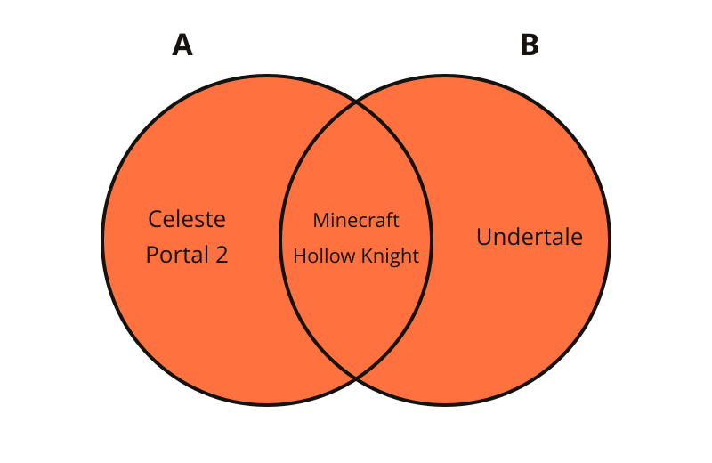
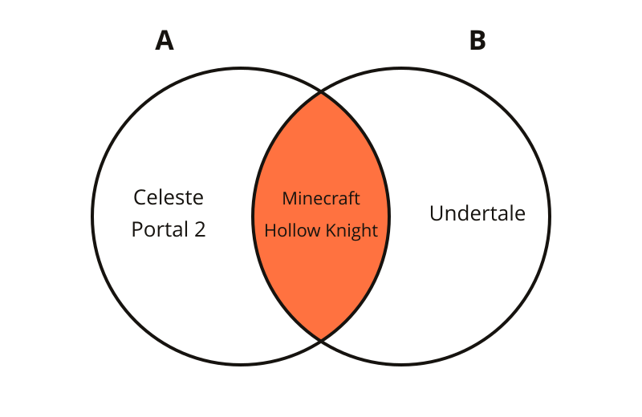
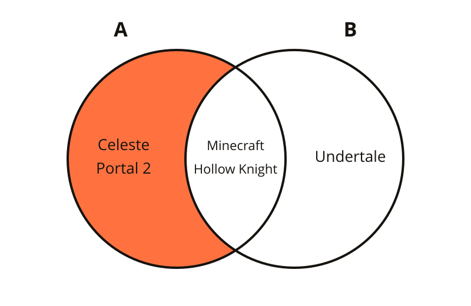
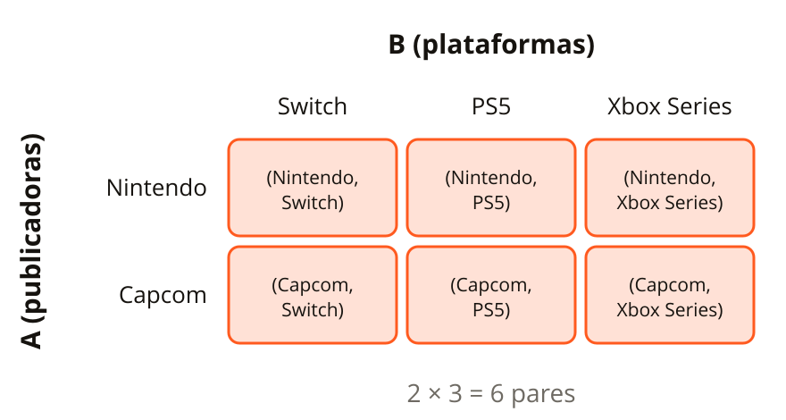
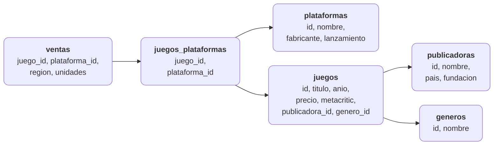
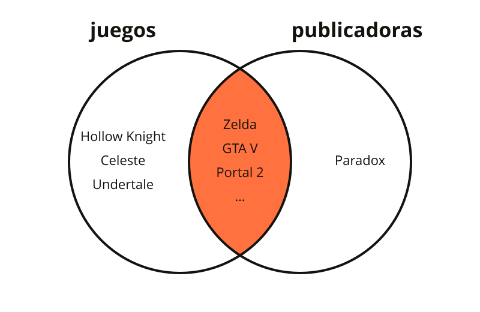
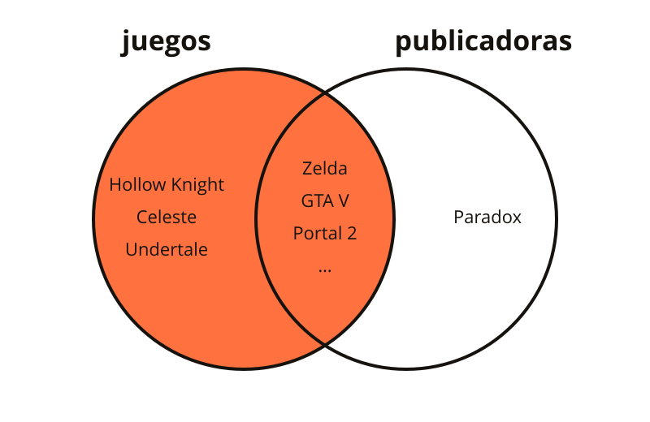
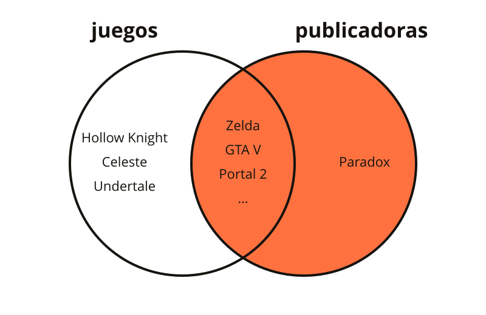
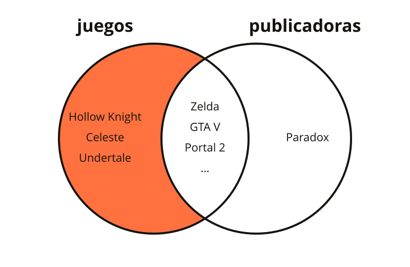
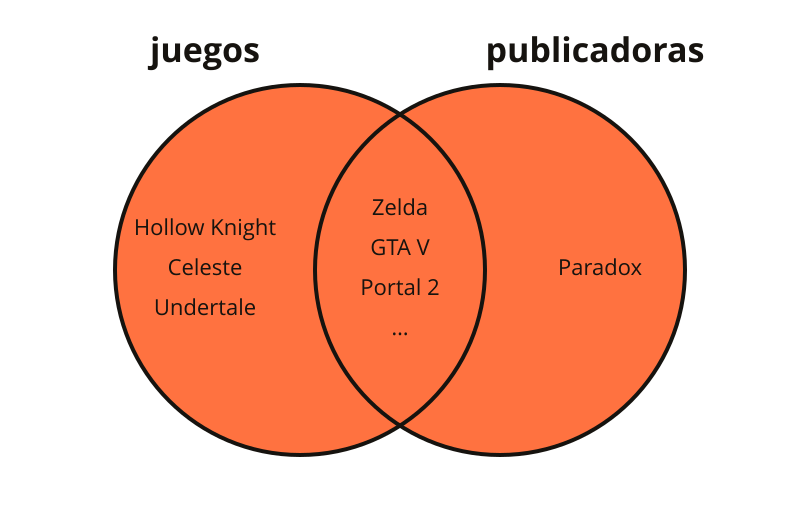

<!-- slide: tipo=portada -->
# SQL – JOINs
Relacionando tablas: de conjuntos a consultas
Clase SQL 2 — 2026

---

# Dónde quedamos

---

## La clase pasada

- Bases de datos relacionales: **tablas**, filas y columnas
- `CREATE TABLE`, `INSERT`, `UPDATE`, `DELETE` y `SELECT ... WHERE`
- Constraints: `NOT NULL`, `UNIQUE`, `PRIMARY KEY`
- Quedaron pendientes: **IDs automáticos** y **relacionar tablas** {tag:info}

---

## IDs automáticos: `SERIAL`

```sql
CREATE TABLE publicadoras (
    id SERIAL PRIMARY KEY,
    nombre TEXT NOT NULL UNIQUE,
    pais TEXT NOT NULL,
    fundacion INTEGER NOT NULL
);

INSERT INTO publicadoras (nombre, pais, fundacion)
VALUES ('Nintendo', 'Japón', 1889);   -- el id (1) lo pone Postgres
```

- `SERIAL` es un entero que Postgres **incrementa solo** en cada `INSERT`
- No pasamos el `id`: se lo dejamos al motor {tag:tip}
- También existe `GENERATED ALWAYS AS IDENTITY`, la versión del estándar SQL {tag:note}

---

## Relacionar tablas: `FOREIGN KEY`

```sql
CREATE TABLE juegos (
    id SERIAL PRIMARY KEY,
    titulo TEXT NOT NULL,
    anio INTEGER NOT NULL,
    precio NUMERIC(6, 2) NOT NULL,
    publicadora_id INTEGER REFERENCES publicadoras(id),
    genero_id INTEGER NOT NULL REFERENCES generos(id),
    metacritic INTEGER
);
```

- `publicadora_id` **apunta** a una fila de `publicadoras`: es una **clave foránea** (FK)
- En vez de repetir "Nintendo, Japón, 1889" en cada juego, guardamos solo el `1`
- Acepta `NULL`: un juego puede **no tener** publicadora (indies autopublicados)

---

## El problema de hoy

```sql
SELECT titulo, publicadora_id
FROM juegos
WHERE genero_id = 2;   -- 2 = Plataformas
```
```
       titulo        | publicadora_id
---------------------+----------------
 Super Mario Odyssey |              1
 It Takes Two        |              2
 Rayman Legends      |              3
 Hollow Knight       |           NULL
 Celeste             |           NULL
```

¿Quién es la publicadora `3`? Los datos están **repartidos** en varias tablas: hay que **juntarlos** con `JOIN`.

---

# Un poco de conjuntos

---

## ¿Por qué conjuntos?

- Codd armó el modelo relacional sobre **matemática**: una tabla es un **conjunto de filas**
- Las operaciones entre tablas son, en el fondo, operaciones entre **conjuntos**
- Si entendemos unión, intersección, diferencia y producto cartesiano, los JOINs salen solos {tag:tip}

Ejemplo: **A** = los juegos que tengo yo, **B** = los que tiene mi amiga.

---

<!-- slide: tipo=imagen-texto -->
## Unión: A ∪ B



- Todo lo que está en **A**, en **B** o en los dos
- A ∪ B = { Celeste, Portal 2, Minecraft, Hollow Knight, Undertale }
- Lo que está en los dos aparece **una sola vez**

---

<!-- slide: tipo=imagen-texto -->
## Intersección: A ∩ B



- Lo que está en **A** y **también** en **B**
- A ∩ B = { Minecraft, Hollow Knight }
- Los juegos que tenemos **los dos**

---

<!-- slide: tipo=imagen-texto -->
## Diferencia: A − B



- Lo que está en **A** pero **no** en **B**
- A − B = { Celeste, Portal 2 }
- El orden importa: B − A = { Undertale } {tag:warning}

---

<!-- slide: tipo=imagen-texto -->
## Producto cartesiano: A × B



- **Todas las combinaciones** de un elemento de A con uno de B
- Si A tiene 2 elementos y B tiene 3 → 2 × 3 = **6 pares**
- El resultado ya no son elementos sueltos: son **pares** (a, b)

---

<!-- slide: tipo=comparacion -->
## Dos formas de combinar tablas

### UNION / INTERSECT / EXCEPT
- Combinan **resultados** que tienen las **mismas columnas**
- **Apilan** filas (una debajo de la otra)
- Son la unión, intersección y diferencia "literales" de SQL

### JOIN
- Combina filas de **tablas distintas**
- **Pega** columnas (una fila al lado de la otra)
- Parte del **producto cartesiano** y se queda con los pares que cumplen una condición → es lo que vemos hoy {tag:tip}

---

# Nuestro dataset: videojuegos

---

## El modelo



Cada flecha va de la **clave foránea** a la tabla que referencia.

---

## Las tablas

- **publicadoras** (9): Nintendo, EA, Ubisoft, Rockstar, CD Projekt, Capcom, Valve, Mojang, Paradox
- **juegos** (28): cada uno con **una** publicadora (o ninguna) y **un** género
- **generos** (13) y **plataformas** (11)
- **juegos_plataformas**: qué juego salió en qué plataforma (relación **N:M**)
- **ventas**: por juego, plataforma y región. Las cifras son **ilustrativas** {tag:note}

---

## Casos borde, a propósito

- **Paradox Interactive**: una publicadora **sin juegos** cargados
- **Hollow Knight, Celeste y Undertale**: juegos **sin publicadora** (`publicadora_id` es `NULL`), porque se autopublicaron
- **Dreamcast**: una plataforma sin juegos. **Estrategia**: un género sin juegos
- Son los que van a hacer que cada tipo de JOIN dé **distinto** {tag:tip}

---

## Cómo cargarlo

- **En clase**: la consola SQL (https://www.intro-camejo.com.ar/sql-juegos/) trae el dataset ya cargado y corre en el navegador
- Archivo: `ejemplos/sql-videojuegos/dataset.sql` en el repo de la materia
- **DB Fiddle** (https://www.db-fiddle.com/): elegir **PostgreSQL 17**, pegar el archivo entero en *Schema SQL* y consultar en *Query SQL*
- **Postgres en Docker** (el `docker-compose.yml` de la clase pasada): `psql -U postgres -d <base> -f dataset.sql`
- En los resultados de hoy, los valores nulos se muestran como `NULL` {tag:note}

---

# Del producto cartesiano al INNER JOIN

---

## `CROSS JOIN`: el producto cartesiano

```sql
SELECT p.nombre AS publicadora, pl.nombre AS plataforma
FROM publicadoras p
CROSS JOIN plataformas pl
WHERE p.pais = 'Japón' AND pl.lanzamiento >= 2017;
```
```
 publicadora |   plataforma
-------------+-----------------
 Nintendo    | PlayStation 5
 Capcom      | PlayStation 5
 Nintendo    | Xbox Series X|S
 Capcom      | Xbox Series X|S
 Nintendo    | Nintendo Switch
 Capcom      | Nintendo Switch
```


---

## Sin filtro, explota

- Recién: 2 publicadoras × 3 plataformas = 6 filas. Pero `juegos CROSS JOIN publicadoras` → 28 × 9 = **252 filas**
- La mayoría no tiene sentido: "Minecraft — Nintendo", "Celeste — Capcom"...
- Solo nos sirven los pares donde `juegos.publicadora_id = publicadoras.id`
- Con tablas de miles de filas, el producto cartesiano es **enorme** {tag:warning}

---

## Producto cartesiano + filtro

```sql
SELECT j.titulo, p.nombre
FROM juegos j, publicadoras p
WHERE j.publicadora_id = p.id AND j.genero_id = 2;
```
```
       titulo        |     nombre
---------------------+-----------------
 Super Mario Odyssey | Nintendo
 It Takes Two        | Electronic Arts
 Rayman Legends      | Ubisoft
```

- La coma es un producto cartesiano; el `WHERE` se queda con los pares que **coinciden**. Mezcla "cómo junto" con "qué filtro" {tag:warning}

---

<!-- slide: tipo=imagen-texto -->
## `INNER JOIN`



- Devuelve solo los pares que **cumplen la condición del `ON`**: la intersección
- Un juego sin publicadora → **no aparece**
- Una publicadora sin juegos → **no aparece**
- `JOIN` a secas es lo mismo que `INNER JOIN`

---

## `INNER JOIN` en SQL

```sql
SELECT j.titulo, p.nombre
FROM juegos j
INNER JOIN publicadoras p ON j.publicadora_id = p.id
WHERE j.genero_id = 2;   -- 2 = Plataformas
```
```
       titulo        |     nombre
---------------------+-----------------
 Super Mario Odyssey | Nintendo
 It Takes Two        | Electronic Arts
 Rayman Legends      | Ubisoft
```

- `ON` dice **cómo se relacionan** las tablas; `WHERE` sigue filtrando. Mismas filas que con la coma {tag:tip}
- Hollow Knight y Celeste (`NULL`) **no aparecen**: no tienen pareja {tag:warning}

---

## Alias de tablas

- `juegos j` es lo mismo que `juegos AS j`: un **apodo** para la tabla dentro de la consulta
- Si una columna existe en las dos tablas (`id`, `nombre`), hay que decir **de cuál**: `j.id`, `p.nombre`
- Sin el prefijo, Postgres responde `column reference "id" is ambiguous` {tag:warning}

---

# OUTER JOINs: LEFT, RIGHT y FULL

---

<!-- slide: tipo=imagen-texto -->
## `LEFT JOIN`



- **Todas** las filas de la tabla de la **izquierda** (la del `FROM`), tengan pareja o no
- Si no tienen pareja, las columnas de la derecha vienen en `NULL`
- En conjuntos: A completo = (A ∩ B) + (A − B)
- `LEFT JOIN` = `LEFT OUTER JOIN`

---

## `LEFT JOIN` en SQL

```sql
SELECT j.titulo, p.nombre
FROM juegos j
LEFT JOIN publicadoras p ON j.publicadora_id = p.id
WHERE j.genero_id = 2;   -- 2 = Plataformas
```
```
       titulo        |     nombre
---------------------+-----------------
 Super Mario Odyssey | Nintendo
 It Takes Two        | Electronic Arts
 Rayman Legends      | Ubisoft
 Hollow Knight       | NULL
 Celeste             | NULL
```

- Cambiamos **una sola palabra** y aparecen los indies {tag:tip}

---

<!-- slide: tipo=imagen-texto -->
## `RIGHT JOIN`



- El espejo del `LEFT`: **todas** las filas de la tabla de la **derecha**
- En conjuntos: B completo = (A ∩ B) + (B − A)
- `A RIGHT JOIN B` da lo mismo que `B LEFT JOIN A`: en la práctica casi todo el mundo usa `LEFT` {tag:note}

---

<!-- slide: tipo=imagen-texto -->
## Anti-join: los que **no** tienen pareja



- A − B: las filas de A **sin** pareja en B
- Receta: `LEFT JOIN` + `WHERE <PK de la derecha> IS NULL`
- Responde preguntas típicas: ¿qué publicadoras no tienen juegos? ¿qué clientes nunca compraron?

---

## Anti-join en SQL

```sql
SELECT p.nombre
FROM publicadoras p
LEFT JOIN juegos j ON j.publicadora_id = p.id
WHERE j.id IS NULL;
```
```
        nombre
---------------------
 Paradox Interactive
```

- Preguntamos por la **PK** de la derecha (`j.id`): en una fila real nunca es `NULL` {tag:tip}
- Siempre `IS NULL`, nunca `= NULL`: con `= NULL` no devuelve **nada** {tag:warning}

---

<!-- slide: tipo=imagen-texto -->
## `FULL OUTER JOIN`



- **Todo** de los dos lados: A ∪ B
- Las filas con pareja salen juntas; las que no tienen pareja (de cualquier lado) salen con `NULL` del otro
- Sobre todo `juegos` con `publicadoras`: **29 filas** = 25 con pareja + 3 juegos sin publicadora + 1 publicadora sin juegos

---

<!-- slide: tipo=hasta-6-imagenes -->
## Resumen visual (1/2)


---

<!-- slide: tipo=hasta-6-imagenes -->
## Resumen visual (2/2)


---

# Más de dos tablas

---

## Encadenar JOINs (chau `genero_id = 2`)

```sql
SELECT j.titulo, g.nombre AS genero, p.nombre AS publicadora
FROM juegos j
JOIN generos g ON g.id = j.genero_id
LEFT JOIN publicadoras p ON p.id = j.publicadora_id
WHERE g.nombre = 'Plataformas';
```
```
       titulo        |   genero    |   publicadora
---------------------+-------------+-----------------
 Super Mario Odyssey | Plataformas | Nintendo
 It Takes Two        | Plataformas | Electronic Arts
 Rayman Legends      | Plataformas | Ubisoft
 Hollow Knight       | Plataformas | NULL
 Celeste             | Plataformas | NULL
```

- Cada JOIN **suma una tabla**: ahora filtramos por el **nombre** del género {tag:tip}

---

<!-- slide: tipo=comparacion -->
## `ON` vs `USING`

### ON
- Cualquier condición: `ON j.publicadora_id = p.id`
- Las columnas pueden llamarse **distinto**
- Es la que más vamos a usar con nuestro esquema (`id` / `publicadora_id`) {tag:tip}

### USING
- Atajo cuando la columna se llama **igual** en las dos tablas: `USING (juego_id)`
- Equivale a `ON a.juego_id = b.juego_id`
- En el resultado, esa columna aparece **una sola vez**

---

## Otras formas de usar un JOIN

- **Relación N:M**: una tabla intermedia (`juegos_plataformas`) guarda **pares de FKs**; se pasa por el medio con **dos** JOINs
- **Self-join**: una tabla contra **sí misma**, con alias distintos. Ej.: `empleados.jefe_id` apunta a otro empleado {tag:info}

---

# Ejercicios

---

## Ejercicios

- **1.** Listar cada juego con el nombre de su **género**
- **2.** Listar **todos** los juegos con el nombre de su publicadora, incluidos los que no tienen
- **3.** ¿Qué **géneros** no tienen ningún juego cargado?

Corran las consultas en la consola SQL (https://www.intro-camejo.com.ar/sql-juegos/) o en DB Fiddle (PostgreSQL 17) {tag:tip}

---

# Soluciones

---

## Solución 1 — juego y género

```sql
SELECT j.titulo, g.nombre AS genero
FROM juegos j
JOIN generos g ON g.id = j.genero_id;
```

- `genero_id` es `NOT NULL`: todo juego tiene género, así que `INNER` alcanza → **28 filas**

---

## Solución 2 — todos los juegos con su publicadora

```sql
SELECT j.titulo, p.nombre AS publicadora
FROM juegos j
LEFT JOIN publicadoras p ON p.id = j.publicadora_id;
```

- **28 filas**: Hollow Knight, Celeste y Undertale salen con publicadora `NULL`
- Con `INNER JOIN` serían 25 {tag:warning}

---

## Solución 3 — géneros sin juegos

```sql
SELECT g.nombre
FROM generos g
LEFT JOIN juegos j ON j.genero_id = g.id
WHERE j.id IS NULL;
```
```
   nombre
------------
 Estrategia
```

---

# GROUP BY

---

## ¿Cuántos juegos tiene cada publicadora?

- Hasta ahora, cada fila del resultado venía de **una fila** de una tabla (o de un par de filas unidas)
- Una pregunta de **resumen** pide otra cosa: **una fila por grupo**. Por publicadora, por plataforma, por año...
- Para eso hay que **agrupar** filas y **resumir** cada grupo con una cuenta, una suma, un promedio... {tag:info}

---

## Funciones de agregación

```sql
SELECT COUNT(*) FROM juegos;
```
```
 count
-------
    28
```

- Una **agregación** resume **muchas filas en un solo valor**: `COUNT`, `SUM`, `AVG`, `MIN`, `MAX`
- Sin `GROUP BY`, todas las filas son **un único grupo**: el resultado es **una sola fila** {tag:note}

---

## `GROUP BY`: una fila por grupo

```sql
SELECT fabricante, COUNT(*)
FROM plataformas
GROUP BY fabricante;
```
```
 fabricante | count
------------+-------
 Microsoft  |     3
 Nintendo   |     2
 Sega       |     1
 Sony       |     4
 Varios     |     1
```

- `GROUP BY` junta las filas con el **mismo fabricante** en un grupo, y `COUNT(*)` cuenta **cada** grupo
- El orden de los grupos **no está garantizado**: para ordenarlos hay que pedir `ORDER BY` {tag:note}

---

## `GROUP BY` con un `JOIN`

```sql
SELECT p.nombre, COUNT(*)
FROM juegos j
JOIN publicadoras p ON j.publicadora_id = p.id
WHERE p.pais = 'Estados Unidos'
GROUP BY p.nombre;
```
```
     nombre      | count
-----------------+-------
 Electronic Arts |     4
 Rockstar Games  |     3
 Valve           |     3
```

- Primero se hace el `JOIN` y **después** se agrupa
- El `WHERE` filtra las filas **antes** de agrupar

---

## La regla del `SELECT`

```sql
SELECT fabricante, nombre, COUNT(*)
FROM plataformas
GROUP BY fabricante;
```
```
ERROR: column "plataformas.nombre" must appear in the GROUP BY clause or be used in an aggregate function
```

- Cada columna del `SELECT` va en el `GROUP BY` o dentro de una **agregación**
- Hay **una fila por grupo**: ¿qué `nombre` mostraría de las 4 plataformas de Sony? {tag:tip}
- Filtrar **grupos** (`HAVING`) y más: lo sigue Gonza {tag:info}

---

# Cierre

---

## Resumen

- `JOIN` combina filas de dos tablas según una condición (`ON`)
- `INNER` = intersección · `LEFT`/`RIGHT` = un lado completo · `FULL` = todo · `CROSS` = todas contra todas
- **Anti-join**: `LEFT JOIN` + `WHERE <PK de la derecha> IS NULL`
- Alias para escribir menos y para **desambiguar** columnas
- `GROUP BY` agrupa filas y las **agregaciones** (`COUNT`, `SUM`...) resumen cada grupo

---

<!-- slide: tipo=bibliografia -->
## Bibliografía

1. PostgreSQL 17 — Joins Between Tables (https://www.postgresql.org/docs/17/tutorial-join.html)
2. PostgreSQL 17 — Joined Tables (https://www.postgresql.org/docs/17/queries-table-expressions.html#QUERIES-JOIN)
3. SQL Joins — W3Schools (https://www.w3schools.com/sql/sql_join.asp)
4. Guía 3 — SQL, de la materia (https://www.intro-camejo.com.ar/docs/Material/Guias/SQL_cons)
5. J. Atwood — A Visual Explanation of SQL Joins (https://blog.codinghorror.com/a-visual-explanation-of-sql-joins/)
6. E. F. Codd — *A Relational Model of Data for Large Shared Data Banks* (Communications of the ACM, 1970)

---

<!-- slide: tipo=cierre -->
# ¡Gracias!
## Ahora Gonza con GROUP BY, con el mismo dataset
