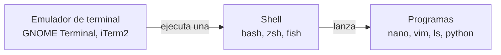

<!-- slide: tipo=portada -->
# Editores, terminales y shells
Herramientas del entorno de desarrollo
Clase 03 - 2026

---

<!-- slide: tipo=agenda -->
## Agenda
- Arquitectura del entorno de trabajo
- Editores de texto
- Terminales y shells
- Permisos en el sistema de archivos
- Recursos de consulta
- Síntesis y práctica

---

# Arquitectura del entorno de trabajo

---

## Definiciones

Al trabajar en una interfaz de línea de comandos intervienen tres
componentes independientes que suelen confundirse. El **emulador de
terminal** es la aplicación que provee la ventana y la entrada y salida de
caracteres. La **shell** es el programa que interpreta los comandos y los
ejecuta. El **editor** es una de las aplicaciones que la shell puede
lanzar.

---

## Relación entre los componentes


---

## Independencia de las capas

Cada componente es reemplazable sin afectar a los demás: una misma shell
puede ejecutarse en distintos emuladores de terminal, y un mismo editor
puede invocarse desde distintas shells. El objetivo de esta clase no es el
dominio de una herramienta en particular, sino el reconocimiento del
conjunto de alternativas disponibles y de los criterios para elegir entre
ellas.

---

# Editores de texto

---

## Definición y alcance

Un editor de texto opera sobre texto plano, es decir, secuencias de
caracteres sin información de formato. Todo código fuente es texto plano.
Dado que constituye la herramienta de uso más intensivo en el desarrollo de
software, existe una diversidad considerable de implementaciones, sin que
ninguna se haya establecido como estándar único.

---

<!-- slide: tipo=comparacion -->
## Clasificación por interfaz

### Editores de terminal
- Operan mediante conexión SSH, sin entorno gráfico
- Están preinstalados en la mayoría de los sistemas Unix
- Se manejan exclusivamente por teclado
- Ejemplos: nano, vim, emacs

### Editores gráficos
- Requieren entorno de escritorio
- Requieren instalación explícita
- Integran depurador, control de versiones y terminal
- Ejemplos: VS Code, Zed, Sublime Text

---

## Editores de terminal
- **nano** - interfaz simple, con los atajos visibles en pantalla
- **vi** - presente en todo sistema Unix desde 1976
- **vim** - extiende vi con resaltado de sintaxis, undo múltiple y plugins
- **neovim** - reimplementación moderna de vim; la más adoptada actualmente
- **emacs** - entorno extensible, no limitado a la edición de texto

---

## nano: operaciones básicas
```bash
nano hola.sh

# Ctrl+O   guardar el archivo (Write Out)
# Ctrl+X   cerrar el editor
# Ctrl+K   eliminar la línea actual
#
# En la barra inferior, el símbolo ^ denota la tecla Ctrl
```

---

## vim: modos de operación

vim distingue entre dos modos de operación. En **modo normal**, que es el
modo inicial, las teclas se interpretan como comandos y no insertan texto.
En **modo inserción**, al que se accede con `i`, las teclas insertan texto.
La tecla `Esc` retorna al modo normal. Esta distinción es la principal
fuente de dificultad para quien lo utiliza por primera vez.

---

## vim: comandos esenciales
```bash
vim hola.sh

# i        pasar a modo inserción
# Esc      volver a modo normal
# :w       guardar
# :q       cerrar el editor
# :q!      cerrar descartando las modificaciones
```

---

## Relación entre vi, vim y neovim
- En las distribuciones actuales, `vi` suele ser un enlace a `vim`
- La verificación se realiza con `ls -l $(which vi)`
- Las instalaciones mínimas pueden incluir `vim-tiny`, con funciones reducidas
- Los comandos presentados operan de forma idéntica en las tres versiones

---

## Editores gráficos
- **VS Code** - el de mayor adopción; catálogo extenso de extensiones
- **Zed** - implementación nativa, orientada al rendimiento
- **Sublime Text** - liviano, con licencia comercial
- **JetBrains** - entornos especializados por lenguaje: PyCharm, IntelliJ
- **Remote - SSH** - extensión que permite editar archivos en un servidor remoto

---

# Terminales y shells

---

## El emulador de terminal

El emulador de terminal gestiona la representación de caracteres, las
pestañas, los colores y las operaciones de copiado y pegado. No interpreta
los comandos ingresados: los transmite a la shell y muestra el resultado
que esta devuelve. La elección del emulador afecta la ergonomía del
trabajo, no las operaciones disponibles.

---

## Emuladores de terminal
- **GNOME Terminal / Konsole** - incluidos en los entornos de escritorio
- **Alacritty / kitty / WezTerm** - con aceleración por GPU
- **iTerm2** - de uso predominante en macOS
- **Windows Terminal** - integrado con WSL
- **tmux** - multiplexor; divide la sesión y persiste ante desconexiones

---

## La shell como intérprete

La shell lee la línea ingresada, la analiza, localiza el programa
correspondiente, lo ejecuta y devuelve el resultado. Constituye además un
lenguaje de programación completo, con variables, estructuras
condicionales e iterativas. Los archivos con extensión `.sh` son programas
escritos en el lenguaje de la shell.

---

## Shells disponibles
- **bash** - estándar de facto en Linux desde la década de 1990
- **zsh** - compatible con bash, con autocompletado extendido
- **fish** - orientada a la usabilidad, sin compatibilidad con bash
- **dash** - implementación mínima; ejecuta los scripts del sistema
- **PowerShell** - propia de Windows; opera sobre objetos en lugar de texto

---

## Identificación de la shell activa
```bash
# shell configurada para el usuario actual
echo $SHELL

# shells instaladas en el sistema
cat /etc/shells

# modificación de la shell por defecto
chsh -s /bin/zsh
```

---

# Permisos en el sistema de archivos

---

## Modelo de permisos de Unix

Unix es un sistema multiusuario: un mismo equipo admite múltiples usuarios
simultáneos. Cada archivo registra un usuario propietario, un grupo, y los
permisos de lectura, escritura y ejecución correspondientes a tres
clases de sujeto. Un archivo creado no recibe permiso de ejecución por
defecto, lo que constituye una medida de seguridad deliberada.

---

## Ejecución denegada
```bash
$ nano hola.sh
$ ./hola.sh
bash: ./hola.sh: Permission denied
```

---

## Estructura de la salida de ls -l
```bash
$ ls -l hola.sh
-rwxr-xr--  1 alumno alumnos  32 Aug 25 14:02 hola.sh

# -        tipo de entrada (- archivo, d directorio, l enlace)
#  rwx     permisos del usuario propietario  (alumno)
#     r-x  permisos del grupo                (alumnos)
#        r--  permisos del resto de los usuarios
```

---

## Los tres bits de permiso
- **r** (read, valor 4) - lectura del contenido
- **w** (write, valor 2) - modificación o eliminación
- **x** (execute, valor 1) - ejecución como programa
- Los valores se suman: `rwx` = 7, `r-x` = 5, `r--` = 4
- La terna se repite para usuario, grupo y resto

---

## chmod: notación simbólica y octal
```bash
# notación simbólica: agregar ejecución al usuario
chmod u+x hola.sh

# notación simbólica: quitar escritura a grupo y resto
chmod go-w hola.sh

# notación octal: rwx r-x r-x
chmod 755 hola.sh

$ ./hola.sh
Hola, mundo
```

---

## Permisos sobre directorios
- En un directorio, `x` habilita el acceso, no la ejecución
- El bit `r` sobre un directorio permite únicamente listar los nombres
- Sin `x` en el directorio, los archivos que contiene son inaccesibles
- Es la causa más frecuente de error en la interpretación de permisos

---

## Riesgos de permisos excesivos
- `chmod 777` otorga control total a cualquier usuario del sistema
- Su uso indica, en general, un diagnóstico incorrecto del problema
- La aplicación recursiva sobre el sistema de archivos lo deja inutilizable
- El criterio aplicable es el de mínimo privilegio necesario

---

# Recursos de consulta

---

## Sitios oficiales: editores
- nano - [nano-editor.org](https://nano-editor.org)
- vim - [vim.org](https://www.vim.org) · neovim - [neovim.io](https://neovim.io)
- emacs - [gnu.org/software/emacs](https://www.gnu.org/software/emacs/)
- VS Code - [code.visualstudio.com](https://code.visualstudio.com)
- Zed - [zed.dev](https://zed.dev) · Sublime - [sublimetext.com](https://www.sublimetext.com)

---

## Sitios oficiales: terminales y shells
- Alacritty - [alacritty.org](https://alacritty.org) · [kitty](https://sw.kovidgoyal.net/kitty/)
- iTerm2 - [iterm2.com](https://iterm2.com)
- tmux - [github.com/tmux/tmux](https://github.com/tmux/tmux)
- bash - [gnu.org/software/bash](https://www.gnu.org/software/bash/) · zsh - [zsh.org](https://www.zsh.org)
- fish - [fishshell.com](https://fishshell.com) · Oh My Zsh - [ohmyz.sh](https://ohmyz.sh)

---

## Referencias rápidas
- [vim.rtorr.com](https://vim.rtorr.com) - comandos de vim, con versión en español
- [devhints.io/linux](https://devhints.io/linux) - comandos de Linux en una página
- [devhints.io/bash](https://devhints.io/bash) - sintaxis de scripting en bash
- [devhints.io/vim](https://devhints.io/vim) y [/vscode](https://devhints.io/vscode) - atajos de los editores
- [explainshell.com](https://explainshell.com) - descompone un comando y explica cada opción

---

## Referencias de permisos
- [chmod-calculator.com](https://chmod-calculator.com) - conversión simbólica y octal
- [linuxize.com/tools/chmod-calculator](https://linuxize.com/tools/chmod-calculator/) - en ambos sentidos
- [explainshell.com](https://explainshell.com) - análisis de comandos como `chmod -R 755 .`
- [The Linux Command Line](https://linuxcommand.org/tlcl.php), capítulo 9 - el tema completo
- `man chmod` y `man chown` - documentación oficial, disponible sin conexión

---

## Consulta desde la línea de comandos
```bash
# documentación completa del comando
man chmod

# ejemplos de uso en lugar del manual (requiere instalación)
tldr chmod

# equivalente accesible por HTTP, sin instalación previa
curl cheat.sh/chmod

# tutorial interactivo de vim
vimtutor
```

---

# Síntesis y práctica

---

## Conceptos centrales

Las herramientas presentadas son alternativas entre las cuales corresponde
elegir según el contexto de trabajo, y no opciones jerarquizadas por
calidad. Dos elementos requieren conocimiento memorizado, dado que un
servidor remoto puede no ofrecer otras herramientas: los comandos de
salida de vim y la interpretación de la salida de `ls -l`.

---

## Ejercicio
```bash
# 1. Crear saludo.sh con nano e incluir una sentencia echo
# 2. Intentar su ejecución mediante ./saludo.sh
# 3. Otorgar permiso de ejecución y repetir el intento
# 4. Establecer los siguientes permisos:
#      propietario: lectura, escritura y ejecución
#      grupo:       lectura y ejecución, sin escritura
#      resto:       sin permisos
# 5. Verificar con ls -l y abrir el archivo con vim
```

---

<!-- slide: tipo=bibliografia -->
## Bibliografía
1. The Linux Command Line - William Shotts (linuxcommand.org)
2. The Missing Semester of Your CS Education - MIT (missing.csail.mit.edu)
3. Vim Cheat Sheet - vim.rtorr.com (disponible en español)
4. Devhints - devhints.io/linux y devhints.io/bash
5. explainshell.com - análisis de comandos por opción
6. chmod-calculator.com - calculadora de permisos
7. `man ls`, `man chmod`, `man bash` - páginas de manual del sistema

---

